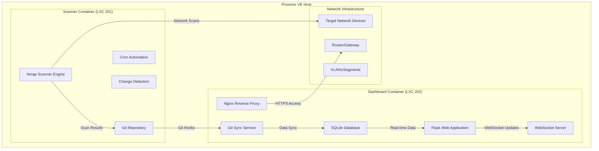

# nMapping+

## Self-hosted Network Mapping with Real-time Web Dashboard

A comprehensive, zero-cost network monitoring solution that combines Nmap scanning, Git-based change tracking, and a modern web dashboard for real-time network visibility. Built on **Proxmox VE Community Scripts** for reliable LXC deployment.

## 🚀 Quick Start

### Automated Deployment

```bash
# Download and run the LXC creation wizard
wget https://raw.githubusercontent.com/YOUR_USERNAME/nmapping-plus/main/scripts/create_nmap_lxc.sh
chmod +x create_nmap_lxc.sh
./create_nmap_lxc.sh
```

### Manual Installation

1. Create LXC containers using [Proxmox VE Community Scripts](https://community-scripts.github.io/ProxmoxVE/)
2. Install scanner: Run `scripts/install_nmap_fingplus.sh` in scanner container
3. Install dashboard: Run `scripts/install_dashboard_enhanced.sh` in dashboard container
4. Configure Git synchronization: Use `scripts/sync_dashboard.sh` for data sync

---

## 📁 Project Structure

```
nMapping+/
├── README.md                           # This file - main project overview
├── scripts/                            # Installation and deployment scripts
│   ├── create_nmap_lxc.sh             # LXC container creation wizard
│   ├── install_nmap_fingplus.sh       # Scanner installation script
│   ├── install_dashboard_enhanced.sh  # Dashboard installation script
│   ├── sync_dashboard.sh              # Data synchronization service
│   └── nmap_fingplus_git.sh           # Legacy scanner script
├── dashboard/                          # Web dashboard application
│   ├── dashboard_app.py               # Main Flask application
│   ├── templates/                     # HTML templates
│   ├── static/                        # CSS, JS, images
│   └── requirements.txt               # Python dependencies
└── docs/                              # Documentation
    ├── deployment-guide.md            # Complete deployment instructions
    ├── architecture.md                # System architecture overview
    ├── api-reference.md               # REST API documentation
    └── troubleshooting.md             # Common issues and solutions
```

---

## 🏗️ System Architecture

### Dual-Container Design



---

## 🌟 Features

### Core Network Monitoring

- **Automated Discovery:** Scheduled Nmap scans for device detection
- **Service Fingerprinting:** OS and service identification
- **Vulnerability Scanning:** Security assessment with CVE mapping
- **Change Tracking:** Git-based audit trail of all network changes
- **Alert System:** Notifications for new devices and vulnerabilities

### Modern Web Dashboard

- **Real-time Updates:** WebSocket-powered live monitoring
- **Interactive Topology:** Visual network device relationships
- **Mobile-Responsive:** Optimized for desktop, tablet, and mobile
- **Advanced Search:** Filter devices by IP, MAC, hostname, service
- **Device Management:** Quick access to blocking and isolation commands
- **Export Capabilities:** CSV/JSON data export for analysis

### Enterprise Features

- **Multi-VLAN Support:** Segment-aware network monitoring
- **LDAP/AD Integration:** Enterprise directory integration
- **REST API:** Programmatic access for external integrations
- **Compliance Reporting:** Automated reports for auditing
- **High Availability:** Optional clustering for mission-critical environments

---

## 🚀 Deployment Options

### 1. Dual-Container Setup (Recommended)

**Best for:** Production environments, large networks, high performance requirements

```bash
./scripts/create_nmap_lxc.sh --both
```

- **Scanner Container:** Dedicated to Nmap operations and Git repository
- **Dashboard Container:** Web interface with SQLite cache and Nginx proxy
- **Benefits:** Component isolation, optimal performance, easier maintenance

### 2. Single Container Setup

**Best for:** Small networks, testing, resource-constrained environments

```bash
./scripts/create_nmap_lxc.sh --single
./scripts/install_dashboard_enhanced.sh --single-container
```

- **Combined Container:** Both scanner and dashboard in one LXC
- **Benefits:** Simpler setup, lower resource usage, easier management

### 3. Docker Alternative

**Best for:** Modern containerized environments, cloud deployments

```bash
./scripts/create_nmap_lxc.sh --docker
```

- **Container Platform:** Docker-based deployment option
- **Benefits:** Modern orchestration, easy scaling, cloud-native approach

---

## 📊 Performance Characteristics

### Scalability

- **Large Networks:** Tested with 1000+ devices
- **Scan Efficiency:** Optimized timing to minimize network impact
- **Real-time Updates:** Sub-second WebSocket data refresh
- **Database Performance:** Indexed SQLite with query optimization

### Resource Requirements

**Minimum (Small Network < 50 devices):**

- CPU: 1 vCPU
- RAM: 512MB
- Storage: 2GB

**Recommended (Medium Network < 500 devices):**

- CPU: 2 vCPU  
- RAM: 1GB
- Storage: 5GB

**Enterprise (Large Network 1000+ devices):**

- CPU: 4 vCPU
- RAM: 2GB
- Storage: 10GB

---

## 🔐 Security Features

### Network Security

- **Container Isolation:** Scanner and dashboard run in separate containers
- **HTTPS Encryption:** All web traffic secured with TLS
- **Firewall Integration:** Automated UFW/iptables configuration
- **Access Controls:** Optional authentication and role-based permissions

### Data Security

- **Git Repository Encryption:** Optional encryption for sensitive scan data
- **Database Security:** SQLite with proper file permissions
- **Audit Logging:** Comprehensive logging of all user actions
- **Backup Encryption:** Encrypted backups with rotation policies

---

## 🔄 Data Flow

### Continuous Monitoring Cycle

1. **Discovery Phase:** Nmap scans discover new devices and services
2. **Analysis Phase:** Changes detected and vulnerabilities assessed  
3. **Storage Phase:** Results committed to Git repository with timestamps
4. **Sync Phase:** Dashboard pulls latest data and updates SQLite cache
5. **Notification Phase:** Real-time WebSocket updates pushed to web clients
6. **Alert Phase:** Notifications sent for critical events and new devices

### Git-based Change Tracking

- **Atomic Commits:** Each scan creates a timestamped commit
- **Diff Analysis:** ndiff comparison between scan results
- **Historical Timeline:** Complete audit trail of network evolution
- **Rollback Capability:** Ability to view network state at any point in time

---

## 🛠️ Installation Scripts

### Core Scripts

| Script | Purpose | Location |
|--------|---------|----------|
| `create_nmap_lxc.sh` | Interactive LXC container creation | `scripts/` |
| `install_nmap_fingplus.sh` | Scanner component installation | `scripts/` |
| `install_dashboard_enhanced.sh` | Dashboard installation with community scripts | `scripts/` |
| `sync_dashboard.sh` | Data synchronization between containers | `scripts/` |
| `dashboard_app.py` | Main Flask web application | `dashboard/` |

### Legacy Scripts

| Script | Purpose | Notes |
|--------|---------|-------|
| `nmap_fingplus_git.sh` | Original scanner script | Single-container deployment |

---

## 📚 Documentation

### Getting Started

- **[[deployment-guide|Deployment Guide]]** - Complete installation and setup instructions
- **[Architecture Overview](docs/architecture.md)** - System design and component relationships
- **[[quick-start|Quick Start Tutorial]]** - 10-minute setup guide

### Advanced Topics

- **[API Reference](docs/api-reference.md)** - REST API endpoints and WebSocket events
- **[Security Guide](docs/security.md)** - Hardening and best practices
- **[Performance Tuning](docs/performance.md)** - Optimization for different environments
- **[Troubleshooting](docs/troubleshooting.md)** - Common issues and solutions

### Integration Guides

- **[LDAP Integration](docs/ldap-integration.md)** - Enterprise directory setup
- **[Webhook Configuration](docs/webhooks.md)** - External system integrations
- **[Custom Alerting](docs/alerting.md)** - Notification configuration

---

## 🌐 Use Cases

### Home Networks

- **Home Lab Monitoring:** Track devices in development environments
- **IoT Device Management:** Monitor smart home devices and security
- **Guest Network Oversight:** Separate monitoring for guest access
- **Security Monitoring:** Detect unauthorized device connections

### Small Business

- **Asset Management:** Complete inventory of network-connected devices
- **Security Compliance:** Meet regulatory requirements with automated reporting
- **Change Management:** Track and approve network infrastructure changes
- **Vendor Monitoring:** Monitor third-party device access and behavior

### Enterprise

- **Large-scale Monitoring:** Support for thousands of network devices
- **Compliance Reporting:** Automated reports for security audits
- **Incident Response:** Rapid detection and response to network anomalies
- **Capacity Planning:** Historical data for network growth planning

---

## 🔮 Future Roadmap

### Planned Features

- **AI-powered Anomaly Detection:** Machine learning for unusual network behavior
- **Mobile Application:** Native mobile app for iOS and Android
- **Advanced Visualization:** 3D network topology and traffic flow diagrams
- **Cloud Integration:** Optional cloud synchronization and backup

### Community Contributions

- **Plugin Architecture:** Extensible system for custom integrations
- **Theme Marketplace:** Community-contributed dashboard themes
- **Integration Library:** Pre-built connectors for popular network tools
- **Localization:** Multi-language support for international deployments

---

## 🤝 Contributing

We welcome contributions from the community! Here's how you can help:

### Development

- **Bug Reports:** Submit issues on GitHub with detailed reproduction steps
- **Feature Requests:** Propose new features with use cases and requirements
- **Code Contributions:** Submit pull requests for bug fixes and new features
- **Documentation:** Improve and expand project documentation

### Community

- **User Support:** Help other users in forums and chat channels
- **Testing:** Test new features and report compatibility issues
- **Tutorials:** Create guides and tutorials for different use cases
- **Translations:** Contribute localization for different languages

---

## 📄 License

This project is licensed under the MIT License - see the [LICENSE](LICENSE) file for details.

---

## 🙏 Acknowledgments

- **Proxmox VE Community Scripts:** Foundation for reliable LXC deployment
- **Nmap Project:** Core network scanning capabilities  
- **Flask Community:** Web framework for the dashboard application
- **SQLite:** Embedded database for high-performance caching
- **Bootstrap:** Responsive UI framework for cross-platform compatibility

---

## 🔗 Quick Links

- **GitHub Repository:** [https://github.com/YOUR_USERNAME/nmapping-plus](https://github.com/YOUR_USERNAME/nmapping-plus)
- **Documentation:** [docs/](docs/)
- **Community Scripts:** [https://community-scripts.github.io/ProxmoxVE/](https://community-scripts.github.io/ProxmoxVE/)
- **Issue Tracker:** [GitHub Issues](https://github.com/YOUR_USERNAME/nmapping-plus/issues)

---

**Ready to get started?** Follow the [[deployment-guide|Deployment Guide]] for step-by-step installation instructions!
