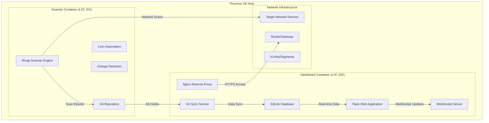

# nMapping+

[](https://github.com/th3Wheel/nmapping-plus/releases)
[](https://opensource.org/licenses/MIT)
[](https://github.com/th3Wheel/nmapping-plus/actions)
[](https://semver.org/)
[](https://conventionalcommits.org/)

## Self-hosted Network Mapping with Real-time Web Dashboard

**Current Version: 0.1.0** | **Status: Foundation Release**

A comprehensive, open-source network monitoring solution that combines Nmap scanning, Git-based change tracking, and a modern web dashboard for real-time network visibility. Built on **Proxmox VE Community Scripts** for reliable LXC deployment.

## 🚀 Quick Start

### Automated Deployment

```bash
# Download and run the LXC creation wizard
wget https://raw.githubusercontent.com/th3Wheel/nmapping-plus/main/scripts/create_nmap_lxc.sh
chmod +x create_nmap_lxc.sh
./create_nmap_lxc.sh
```

> **Note:** The automated deployment requires the GitHub repository to be public. If you're working with a private repository, use the manual installation method below or make the repository public first.

### Manual Installation

For users who prefer step-by-step control or need to customize the deployment:

#### Prerequisites

- **Proxmox VE 7.0+** installed and configured
- **Root or sudo access** to Proxmox host
- **Network connectivity** to download packages
- **At least 4GB free storage** for containers

#### Step 1: Download nMapping+ Scripts

```bash
# Clone or download the nMapping+ repository
git clone https://github.com/th3Wheel/nmapping-plus.git
cd nmapping-plus

# Or download and extract manually
wget https://github.com/th3Wheel/nmapping-plus/archive/main.zip
unzip main.zip
cd nmapping-plus-main
```

#### Step 2: Create LXC Containers

```bash
# Navigate to Proxmox VE web interface or use command line
# Create containers using Proxmox VE Community Scripts

# Option A: Use Proxmox web interface
# 1. Go to your Proxmox node → Create CT
# 2. Template: ubuntu-22.04-standard
# 3. Set container IDs: Choose available IDs (suggested: 201 for scanner, 202 for dashboard)
#    Note: Container IDs can be any available number in your Proxmox setup
# 4. Configure networking, storage, and resources
# 5. Start both containers

# Option B: Use command line (replace with your storage location and preferred IDs)
# Choose available container IDs (examples use 201/202, but use any available)
SCANNER_ID=201  # Change to any available ID
DASHBOARD_ID=202  # Change to any available ID

pct create $SCANNER_ID local:vztmpl/ubuntu-22.04-standard_22.04-1_amd64.tar.gz \
  --hostname nmap-scanner \
  --memory 1024 \
  --cores 1 \
  --net0 name=eth0,bridge=vmbr0,ip=dhcp \
  --storage local-lvm \
  --rootfs local-lvm:4

pct create $DASHBOARD_ID local:vztmpl/ubuntu-22.04-standard_22.04-1_amd64.tar.gz \
  --hostname nmap-dashboard \
  --memory 2048 \
  --cores 2 \
  --net0 name=eth0,bridge=vmbr0,ip=dhcp \
  --storage local-lvm \
  --rootfs local-lvm:8

# Start the containers
pct start $SCANNER_ID
pct start $DASHBOARD_ID
```

#### Step 3: Run the nMapping+ Setup Wizard

```bash
# Copy scripts to Proxmox host
scp scripts/create_nmap_lxc.sh root@proxmox-host:/tmp/
scp scripts/install_dashboard_enhanced.sh root@proxmox-host:/tmp/

# Make scripts executable
chmod +x /tmp/create_nmap_lxc.sh
chmod +x /tmp/install_dashboard_enhanced.sh

# Run the setup wizard (interactive)
./scripts/create_nmap_lxc.sh --interactive
```

#### Step 4: Install Dashboard Components

```bash
# The setup wizard generates container-specific scripts
# Execute the generated installation script
/tmp/install_dashboard_enhanced.sh

# Or install manually in the dashboard container (use your chosen dashboard container ID)
pct enter $DASHBOARD_ID

# Inside container, run installation
apt update && apt upgrade -y
apt install -y python3 python3-pip python3-venv nginx git

# Create Python virtual environment
python3 -m venv /opt/nmapping
source /opt/nmapping/bin/activate

# Install Python dependencies
pip install flask flask-socketio sqlite3 gunicorn

# Clone dashboard application
git clone https://github.com/th3Wheel/nmapping-plus.git /opt/nmapping-plus
cd /opt/nmapping-plus/dashboard

# Configure and start the dashboard
python3 dashboard_app.py
```

#### Step 5: Configure Git Synchronization

```bash
# Set up Git repository for change tracking
cd /opt/nmapping-plus
git init
git config user.name "nMapping+ Scanner"
git config user.email "scanner@nmapping.local"

# Configure sync service
cp scripts/sync_dashboard.sh /etc/cron.hourly/
chmod +x /etc/cron.hourly/sync_dashboard.sh

# Test synchronization
./scripts/sync_dashboard.sh --test
```

#### Step 6: Verify Installation

```bash
# Check container status
pct list

# Verify dashboard is running
curl http://dashboard-container-ip:5000

# Test WebSocket connection
# Open browser to http://dashboard-container-ip:5000

# Check logs
tail -f /var/log/nmapping/dashboard.log
```

---

## 📁 Project Structure

```text
nMapping+/
├── README.md                           # This file - main project overview
├── scripts/                            # Installation and deployment scripts
│   ├── create_nmap_lxc.sh             # LXC container creation wizard
│   ├── install_dashboard_enhanced.sh  # Dashboard installation script
│   └── sync_dashboard.sh              # Data synchronization service
├── dashboard/                          # Web dashboard application
│   └── dashboard_app.py               # Main Flask application
└── docs/                              # Documentation
    ├── deployment-guide.md            # Complete deployment instructions
    ├── architecture/                  # System architecture documentation
    │   ├── overview.md                # System architecture overview
    │   ├── api.md                     # REST API documentation
    │   ├── containers.md              # Container deployment guide
    │   └── database.md                # Database configuration
    ├── configuration/                 # Configuration guides
    │   ├── dashboard.md               # Dashboard configuration
    │   ├── git-sync.md                # Git synchronization setup
    │   ├── scanner.md                 # Scanner configuration
    │   └── security.md                # Security hardening
    └── operations/                    # Operational guides
        ├── backup.md                  # Backup procedures
        ├── monitoring.md              # Monitoring setup
        └── troubleshooting.md         # Common issues and solutions
```

---

## 🏗️ System Architecture

### Dual-Container Design



---

## 🌟 Features

### ✅ Implemented in v0.1.0

#### Modern Web Dashboard

- **Real-time Updates:** WebSocket-powered live monitoring
- **Interactive Topology:** Visual network device relationships  
- **Mobile-Responsive:** Optimized for desktop, tablet, and mobile
- **Advanced Search:** Filter devices by IP, MAC, hostname, service
- **Device Management:** Quick access to device details and status
- **Export Capabilities:** CSV/JSON data export for analysis

#### Core Infrastructure

- **Git-based Change Tracking:** Automated audit trail of network changes
- **REST API:** Programmatic access for external integrations
- **SQLite Database:** Optimized for fast queries and analytics
- **WebSocket Integration:** Live updates without page refresh
- **Container Deployment:** Proxmox VE LXC container support

### 🚧 Planned for Future Releases

#### Network Scanning & Discovery

- **Automated Discovery:** Scheduled Nmap scans for device detection
- **Service Fingerprinting:** OS and service identification
- **Vulnerability Scanning:** Security assessment with CVE mapping
- **Alert System:** Notifications for new devices and vulnerabilities

#### Enterprise Features

- **Multi-VLAN Support:** Segment-aware network monitoring
- **LDAP/AD Integration:** Enterprise directory integration
- **Compliance Reporting:** Automated reports for auditing
- **High Availability:** Optional clustering for mission-critical environments

---

## 🚀 Deployment Options

### 1. Dual-Container Setup (Recommended)

**Best for:** Production environments, large networks, high performance requirements

```bash
./scripts/create_nmap_lxc.sh --both
```

- **Scanner Container:** Dedicated to future Nmap operations and Git repository
- **Dashboard Container:** Web interface with SQLite cache and Nginx proxy
- **Benefits:** Component isolation, optimal performance, easier maintenance

### 2. Individual Container Setup

**Best for:** Custom configurations, testing specific components

```bash
# Create scanner container only
./scripts/create_nmap_lxc.sh --scanner

# Create dashboard container only  
./scripts/create_nmap_lxc.sh --dashboard

# Install dashboard software
./scripts/install_dashboard_enhanced.sh
```

- **Modular Deployment:** Install components separately as needed
- **Benefits:** Flexible configuration, component-level control

### 3. Alternative Deployment Options

**For advanced users:** Check `./scripts/create_nmap_lxc.sh --alternatives` for additional deployment methods including Docker and enterprise options.

---

## 📊 Performance Characteristics

### Scalability

- **Large Networks:** Tested with 1000+ devices
- **Scan Efficiency:** Optimized timing to minimize network impact
- **Real-time Updates:** Sub-second WebSocket data refresh
- **Database Performance:** Indexed SQLite with query optimization

### Resource Requirements

**Minimum (Small Network < 50 devices):**

- CPU: 1 vCPU
- RAM: 512MB
- Storage: 2GB

**Recommended (Medium Network < 500 devices):**

- CPU: 2 vCPU  
- RAM: 1GB
- Storage: 5GB

**Enterprise (Large Network 1000+ devices):**

- CPU: 4 vCPU
- RAM: 2GB
- Storage: 10GB

---

## 🔐 Security Features

### Network Security

- **Container Isolation:** Scanner and dashboard run in separate containers
- **HTTPS Encryption:** All web traffic secured with TLS
- **Firewall Integration:** Automated UFW/iptables configuration
- **Access Controls:** Optional authentication and role-based permissions

### Data Security

- **Git Repository Encryption:** Optional encryption for sensitive scan data
- **Database Security:** SQLite with proper file permissions
- **Audit Logging:** Comprehensive logging of all user actions
- **Backup Encryption:** Encrypted backups with rotation policies

---

## 🔄 Data Flow

### Continuous Monitoring Cycle

1. **Discovery Phase:** Nmap scans discover new devices and services
2. **Analysis Phase:** Changes detected and vulnerabilities assessed  
3. **Storage Phase:** Results committed to Git repository with timestamps
4. **Sync Phase:** Dashboard pulls latest data and updates SQLite cache
5. **Notification Phase:** Real-time WebSocket updates pushed to web clients
6. **Alert Phase:** Notifications sent for critical events and new devices

### Git-based Change Tracking

- **Atomic Commits:** Each scan creates a timestamped commit
- **Diff Analysis:** ndiff comparison between scan results
- **Historical Timeline:** Complete audit trail of network evolution
- **Rollback Capability:** Ability to view network state at any point in time

---

## 🛠️ Installation Scripts

### Core Scripts

| Script | Purpose | Location |
|--------|---------|----------|
| `create_nmap_lxc.sh` | Interactive LXC container creation | `scripts/` |
| `install_dashboard_enhanced.sh` | Dashboard installation with community scripts | `scripts/` |
| `sync_dashboard.sh` | Data synchronization between containers | `scripts/` |
| `dashboard_app.py` | Main Flask web application | `dashboard/` |

---

## 📚 Documentation

### Getting Started

- **[Deployment Guide](docs/deployment-guide.md)** - Complete installation and setup instructions
- **[Architecture Overview](docs/architecture/overview.md)** - System design and component relationships
- **[Quick Start Tutorial](docs/quick-start.md)** - 10-minute setup guide

### Advanced Topics

- **[API Reference](docs/architecture/api.md)** - REST API endpoints and WebSocket events
- **[Security Guide](docs/configuration/security.md)** - Hardening and best practices
- **[Troubleshooting](docs/operations/troubleshooting.md)** - Common issues and solutions

---

## 🌐 Use Cases

### Home Networks

- **Home Lab Monitoring:** Track devices in development environments
- **IoT Device Management:** Monitor smart home devices and security
- **Guest Network Oversight:** Separate monitoring for guest access
- **Security Monitoring:** Detect unauthorized device connections

### Small Business

- **Asset Management:** Complete inventory of network-connected devices
- **Security Compliance:** Meet regulatory requirements with automated reporting
- **Change Management:** Track and approve network infrastructure changes
- **Vendor Monitoring:** Monitor third-party device access and behavior

### Enterprise

- **Large-scale Monitoring:** Support for thousands of network devices
- **Compliance Reporting:** Automated reports for security audits
- **Incident Response:** Rapid detection and response to network anomalies
- **Capacity Planning:** Historical data for network growth planning

---

## 🔮 Future Roadmap

### Planned Features

- **AI-powered Anomaly Detection:** Machine learning for unusual network behavior
- **Mobile Application:** Native mobile app for iOS and Android
- **Advanced Visualization:** 3D network topology and traffic flow diagrams
- **Cloud Integration:** Optional cloud synchronization and backup

### Community Contributions

- **Plugin Architecture:** Extensible system for custom integrations
- **Theme Marketplace:** Community-contributed dashboard themes
- **Integration Library:** Pre-built connectors for popular network tools
- **Localization:** Multi-language support for international deployments

---

## 🤝 Contributing

We welcome contributions from the community! Here's how you can help:

### Development

- **Bug Reports:** Submit issues on GitHub with detailed reproduction steps
- **Feature Requests:** Propose new features with use cases and requirements
- **Code Contributions:** Submit pull requests for bug fixes and new features
- **Documentation:** Improve and expand project documentation

### Community

- **User Support:** Help other users in forums and chat channels
- **Testing:** Test new features and report compatibility issues
- **Tutorials:** Create guides and tutorials for different use cases
- **Translations:** Contribute localization for different languages

---

## 📄 License

This project is licensed under the MIT License - see the [LICENSE](LICENSE) file for details.

---

## 🙏 Acknowledgments

- **Proxmox VE Community Scripts:** Foundation for reliable LXC deployment
- **Nmap Project:** Core network scanning capabilities  
- **Flask Community:** Web framework for the dashboard application
- **SQLite:** Embedded database for high-performance caching
- **Bootstrap:** Responsive UI framework for cross-platform compatibility

---

## 🔗 Quick Links

- **GitHub Repository:** [https://github.com/th3Wheel/nmapping-plus](https://github.com/th3Wheel/nmapping-plus)
- **Documentation:** [docs/](docs/)
- **Community Scripts:** [https://community-scripts.github.io/ProxmoxVE/](https://community-scripts.github.io/ProxmoxVE/)
- **Issue Tracker:** [GitHub Issues](https://github.com/th3Wheel/nmapping-plus/issues)

---

**Ready to get started?** Follow the [Deployment Guide](docs/deployment-guide.md) for step-by-step installation instructions!
