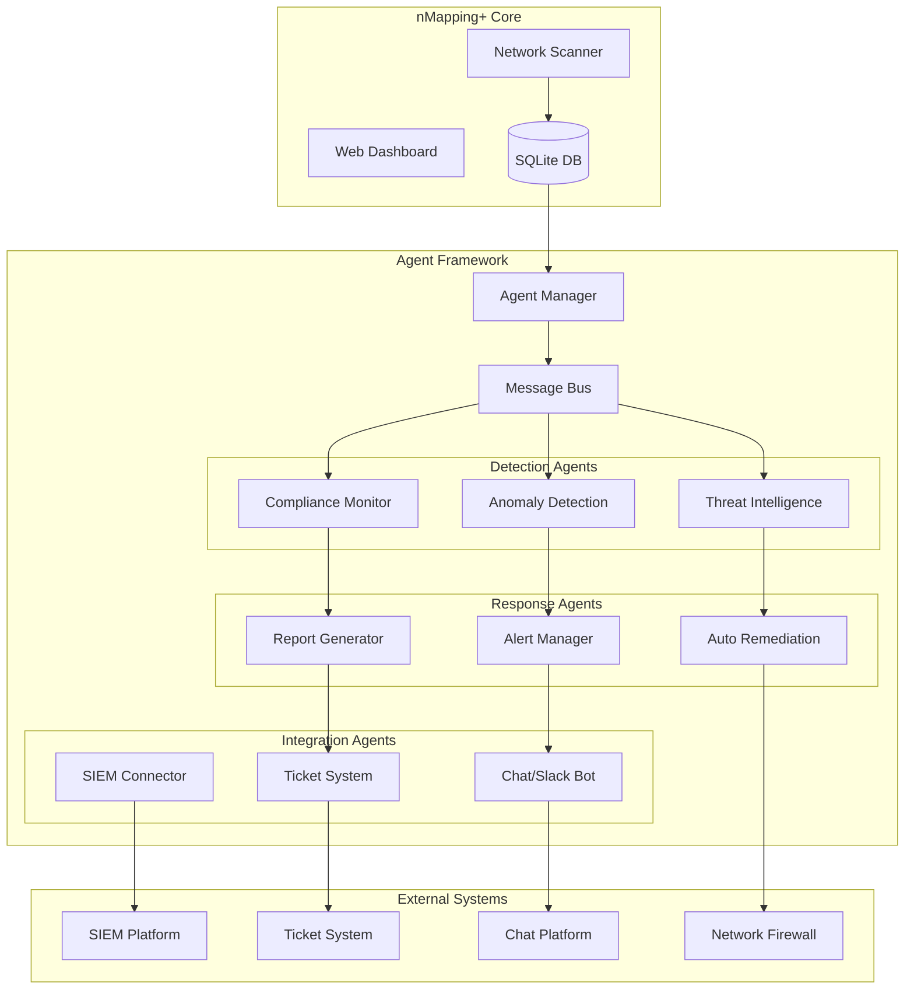

# nMapping+ Agents Framework

## 🤖 Intelligent Automation for Network Monitoring

The nMapping+ Agents framework provides intelligent automation capabilities for advanced network monitoring, analysis, and response. These agents extend the core functionality with AI-powered insights, automated remediation, and proactive network management.

## 📋 Table of Contents

- [[#overview|Overview]]
- [[#agent-types|Agent Types]]
- [[#installation--configuration|Installation & Configuration]]
- [[#built-in-agents|Built-in Agents]]
- [[#custom-agent-development|Custom Agent Development]]
- [[#agent-communication|Agent Communication]]
- [[#security-considerations|Security Considerations]]
- [[#performance--monitoring|Performance & Monitoring]]
- [[#troubleshooting|Troubleshooting]]

## 🎯 Overview

### What are nMapping+ Agents?

Agents are autonomous software components that:

- **Monitor** network conditions continuously
- **Analyze** patterns and anomalies using AI/ML
- **Respond** to events with predefined or learned actions
- **Integrate** with external systems and APIs
- **Learn** from network behavior over time

### Architecture



## 🔧 Agent Types

### 1. Detection Agents

**Purpose**: Identify patterns, anomalies, and security threats

- **Anomaly Detection**: Machine learning-based behavior analysis
- **Threat Intelligence**: Integration with threat feeds and indicators
- **Compliance Monitoring**: Policy and regulation compliance checking
- **Performance Analysis**: Network performance degradation detection
- **Asset Discovery**: Advanced device classification and tracking

### 2. Response Agents

**Purpose**: Automated actions based on detection results

- **Alert Management**: Intelligent alert correlation and escalation
- **Auto Remediation**: Automated response to known issues
- **Report Generation**: Scheduled and event-driven reporting
- **Notification Routing**: Multi-channel notification management
- **Workflow Orchestration**: Complex multi-step response workflows

### 3. Integration Agents

**Purpose**: Connect nMapping+ with external systems

- **SIEM Connectors**: Splunk, QRadar, ArcSight, Elastic Security
- **Ticket Systems**: Jira, ServiceNow, Zendesk, GitHub Issues
- **Chat Platforms**: Slack, Microsoft Teams, Discord, Mattermost
- **Network Devices**: Switch/router configuration management
- **Cloud APIs**: AWS, Azure, GCP security and networking APIs

### 4. Analysis Agents

**Purpose**: Advanced data processing and insights

- **Trend Analysis**: Historical pattern recognition
- **Predictive Modeling**: Forecasting network changes
- **Risk Assessment**: Security risk scoring and prioritization
- **Capacity Planning**: Resource utilization predictions
- **Behavioral Baselining**: Normal behavior pattern establishment

## 🚀 Installation & Configuration

### Prerequisites

```bash
# Python 3.9+ with additional ML libraries
pip install scikit-learn pandas numpy tensorflow

# Optional: GPU support for ML models
pip install tensorflow-gpu

# Message queue for agent communication
sudo apt install redis-server
pip install redis celery
```

### Agent Framework Installation

```bash
# Navigate to nMapping+ directory
cd nMapping+

# Install agent framework
pip install -r agents/requirements.txt

# Initialize agent database
python agents/setup.py --init-db

# Start agent manager
python agents/manager.py --start
```

### Configuration

Edit `agents/config.yml`:

```yaml
# Agent Framework Configuration
framework:
  message_bus: "redis://localhost:6379/0"
  agent_timeout: 300
  max_concurrent_agents: 10
  log_level: "INFO"

# Detection Agents
detection:
  anomaly_detection:
    enabled: true
    model_type: "isolation_forest"
    training_window: 7  # days
    threshold: 0.05
    
  threat_intelligence:
    enabled: true
    feeds:
      - "https://api.malwaredomainlist.com/v1/blocklist"
      - "https://rules.emergingthreats.net/blockrules/"
    update_interval: 3600  # seconds

# Response Agents  
response:
  auto_remediation:
    enabled: false  # Enable with caution
    allowed_actions:
      - "quarantine_device"
      - "block_ip"
      - "create_ticket"
    approval_required: true

# Integration Agents
integration:
  slack:
    enabled: false
    webhook_url: "https://hooks.slack.com/..."
    channels:
      alerts: "#network-alerts"
      reports: "#network-reports"
      
  siem:
    enabled: false
    type: "splunk"  # splunk, qradar, elastic
    endpoint: "https://splunk.company.com:8089"
    token: "${SPLUNK_TOKEN}"
```

## 🛠️ Built-in Agents

### Anomaly Detection Agent

**Purpose**: Detect unusual network behavior using machine learning

**Features**:

- Isolation Forest for outlier detection
- Time-series analysis for traffic patterns
- Device behavior profiling
- Automated threshold adjustment

**Configuration**:

```yaml
anomaly_detection:
  model_type: "isolation_forest"  # isolation_forest, one_class_svm, autoencoder
  features:
    - "device_count_change"
    - "new_services_detected"
    - "unusual_traffic_patterns"
    - "off_hours_activity"
  sensitivity: "medium"  # low, medium, high
  training_data_days: 30
```

**Usage**:

```python
from agents.detection.anomaly import AnomalyDetectionAgent

agent = AnomalyDetectionAgent()
agent.train_model()  # Train on historical data
anomalies = agent.detect_anomalies()  # Get current anomalies
agent.update_model()  # Incremental learning
```

### Threat Intelligence Agent

**Purpose**: Integrate external threat feeds and IOCs

**Features**:

- Multiple threat feed integration
- IP/domain reputation checking
- Automated IOC enrichment
- Custom threat feed support

**Configuration**:

```yaml
threat_intelligence:
  feeds:
    malware_domains:
      url: "https://api.malwaredomainlist.com/v1/blocklist"
      format: "json"
      update_interval: 3600
    
    emerging_threats:
      url: "https://rules.emergingthreats.net/blockrules/"
      format: "suricata"
      update_interval: 1800
      
  custom_feeds:
    - "/path/to/custom_iocs.json"
    
  reputation_apis:
    virustotal:
      api_key: "${VT_API_KEY}"
      rate_limit: 4  # requests per minute
```

### Auto Remediation Agent

**Purpose**: Automated response to security events

**Features**:

- Rule-based response actions
- Approval workflows for critical actions
- Integration with network devices
- Rollback capabilities

**Configuration**:

```yaml
auto_remediation:
  rules:
    - name: "Block malicious IP"
      trigger: "threat_detected"
      conditions:
        - "threat_score > 8"
        - "source_external == true"
      actions:
        - "block_ip_firewall"
        - "create_incident_ticket"
      approval_required: false
      
    - name: "Quarantine infected device"  
      trigger: "malware_detected"
      conditions:
        - "confidence > 0.9"
      actions:
        - "quarantine_device"
        - "notify_security_team"
      approval_required: true
```

### SIEM Integration Agent

**Purpose**: Forward events and data to SIEM platforms

**Supported Platforms**:

- Splunk
- IBM QRadar
- ArcSight
- Elastic Security
- Chronicle
- Azure Sentinel

**Configuration**:

```yaml
siem_integration:
  splunk:
    endpoint: "https://splunk.company.com:8088/services/collector"
    token: "${SPLUNK_HEC_TOKEN}"
    index: "network_monitoring"
    source: "nmapping_plus"
    
  elastic:
    endpoint: "https://elastic.company.com:9200"
    username: "${ELASTIC_USER}"
    password: "${ELASTIC_PASS}"
    index: "nmapping-plus-%{+yyyy.MM.dd}"
```

## 🔨 Custom Agent Development

### Agent Base Class

```python
from agents.base import BaseAgent
from typing import Dict, List, Any
import logging

class CustomAgent(BaseAgent):
    def __init__(self, config: Dict[str, Any]):
        super().__init__(config)
        self.name = "custom_agent"
        self.version = "1.0.0"
        
    def initialize(self) -> bool:
        """Initialize agent resources"""
        self.logger.info(f"Initializing {self.name}")
        # Setup code here
        return True
        
    def process_event(self, event: Dict[str, Any]) -> List[Dict[str, Any]]:
        """Process incoming events"""
        results = []
        
        # Event processing logic
        if event.get('type') == 'device_discovered':
            result = self.handle_device_discovery(event)
            results.append(result)
            
        return results
        
    def handle_device_discovery(self, event: Dict[str, Any]) -> Dict[str, Any]:
        """Handle device discovery events"""
        device_ip = event.get('device_ip')
        
        # Custom logic here
        analysis_result = {
            'agent': self.name,
            'event_id': event.get('id'),
            'device_ip': device_ip,
            'analysis': 'custom_analysis_result',
            'recommendations': ['action1', 'action2']
        }
        
        return analysis_result
        
    def cleanup(self) -> None:
        """Cleanup agent resources"""
        self.logger.info(f"Cleaning up {self.name}")
        # Cleanup code here
```

### Agent Registration

```python
# agents/registry.py
from agents.custom_agent import CustomAgent

AGENT_REGISTRY = {
    'anomaly_detection': 'agents.detection.anomaly.AnomalyDetectionAgent',
    'threat_intelligence': 'agents.detection.threat.ThreatIntelligenceAgent',
    'auto_remediation': 'agents.response.remediation.AutoRemediationAgent',
    'custom_agent': CustomAgent,  # Your custom agent
}
```

### Event Types

Common event types that agents can process:

```python
EVENT_TYPES = {
    # Discovery Events
    'device_discovered': 'New device found on network',
    'device_disappeared': 'Device no longer responding',
    'service_discovered': 'New service detected on device',
    
    # Security Events  
    'threat_detected': 'Security threat identified',
    'anomaly_detected': 'Unusual behavior detected',
    'vulnerability_found': 'Security vulnerability discovered',
    
    # Network Events
    'network_change': 'Network topology changed',
    'performance_degraded': 'Network performance issue',
    'connectivity_lost': 'Device connectivity lost',
    
    # System Events
    'scan_completed': 'Network scan finished',
    'agent_started': 'Agent became active',
    'agent_error': 'Agent encountered error'
}
```

## 📡 Agent Communication

### Message Bus Architecture

Agents communicate through a Redis-based message bus:

```python
from agents.messaging import MessageBus

# Initialize message bus
bus = MessageBus()

# Subscribe to events
bus.subscribe('device_discovered', callback_function)

# Publish events
event = {
    'type': 'threat_detected',
    'device_ip': '192.168.1.100',
    'threat_type': 'malware',
    'confidence': 0.95,
    'timestamp': datetime.utcnow().isoformat()
}
bus.publish('threat_detected', event)
```

### Agent-to-Agent Communication

```python
# Direct agent communication
from agents.manager import AgentManager

manager = AgentManager()

# Send message to specific agent
manager.send_message(
    target_agent='auto_remediation',
    message={
        'action': 'block_ip',
        'ip_address': '192.168.1.100',
        'reason': 'malware_detected'
    }
)

# Broadcast to all agents
manager.broadcast({
    'type': 'system_alert',
    'message': 'High threat level detected'
})
```

## 🔒 Security Considerations

### Agent Isolation

```yaml
security:
  agent_isolation:
    enabled: true
    sandboxing: "docker"  # docker, systemd, none
    resource_limits:
      memory: "512M"
      cpu: "0.5"
      network: "restricted"
      
  authentication:
    inter_agent_auth: true
    api_key_required: true
    certificate_validation: true
    
  permissions:
    default_permissions: "read"
    privileged_agents:
      - "auto_remediation"  # Can modify network
      - "siem_integration"  # Can access external APIs
```

### Audit Logging

```python
# All agent actions are logged
from agents.audit import AuditLogger

audit = AuditLogger()
audit.log_action(
    agent='auto_remediation',
    action='block_ip',
    target='192.168.1.100',
    reason='threat_detected',
    success=True
)
```

## 📊 Performance & Monitoring

### Agent Health Monitoring

```python
# agents/health.py
from agents.monitoring import HealthMonitor

monitor = HealthMonitor()

# Check agent health
health_status = monitor.check_all_agents()

# Agent metrics
metrics = monitor.get_agent_metrics('anomaly_detection')
# Returns: CPU usage, memory usage, events processed, errors, uptime
```

### Performance Tuning

```yaml
performance:
  batch_processing:
    enabled: true
    batch_size: 100
    batch_timeout: 30
    
  caching:
    enabled: true
    cache_type: "redis"
    ttl: 3600
    
  async_processing:
    enabled: true
    worker_threads: 4
    queue_size: 1000
```

## 🐛 Troubleshooting

### Common Issues

#### Agent Not Starting

```bash
# Check agent logs
tail -f logs/agent_manager.log

# Verify configuration
python agents/validate_config.py

# Test agent individually
python agents/test_agent.py --agent anomaly_detection
```

#### High Memory Usage

```yaml
# Reduce memory usage in config
performance:
  model_cache_size: 100  # Reduce from default 500
  batch_size: 50  # Reduce from default 100
  enable_gc: true  # Enable garbage collection
```

#### Agent Communication Issues

```bash
# Check Redis connection
redis-cli ping

# Verify message bus
python agents/test_messaging.py

# Check agent registration
python agents/list_agents.py
```

### Debug Mode

```bash
# Start agents in debug mode
python agents/manager.py --debug --log-level DEBUG

# Enable trace logging
export NMAPPING_AGENT_TRACE=1
python agents/manager.py
```

### Agent Status Dashboard

Access the agent status dashboard at:
`http://your-dashboard-host:5000/agents`

Features:

- Real-time agent status
- Performance metrics
- Event processing stats
- Error logs and alerts
- Agent configuration management

## 🔮 Future Enhancements

### Planned Features

- **Deep Learning Models**: Advanced neural networks for pattern recognition
- **Federated Learning**: Collaborative learning across multiple installations
- **Natural Language Processing**: Chat-based network queries and alerts
- **Predictive Analytics**: Proactive issue identification and prevention
- **Mobile Agents**: Lightweight agents for edge devices and IoT

### Community Contributions

- **Agent Marketplace**: Share and discover community-created agents
- **Template Library**: Pre-built agent templates for common use cases
- **Integration Plugins**: Easy integration with popular tools and platforms
- **ML Model Sharing**: Community-trained models for threat detection

## 📞 Support

### Getting Help

- **Documentation**: [[nMapping+/docs/agents/index|Agent Framework Docs]]
- **Examples**: [[nMapping+/examples/agents/README|Agent Examples Repository]]
- **Community**: [GitHub Discussions](https://github.com/YOUR_USERNAME/nmapping-plus/discussions)
- **Issues**: [Bug Reports](https://github.com/YOUR_USERNAME/nmapping-plus/issues)

### Professional Support

For enterprise deployments and custom agent development:

- **Consulting**: Custom agent development and integration
- **Training**: Agent framework workshops and certification
- **Support**: Priority support for production deployments

---

**🤖 Ready to supercharge your network monitoring with intelligent agents?**

Start with the built-in anomaly detection agent and gradually add more sophisticated automation as your needs grow!

*The future of network monitoring is autonomous, intelligent, and proactive.*
