# nMapping+ System Architecture

**Version**: 1.0.0  
**Last Updated**: 2025-10-19  
**Status**: 🔵 Design Complete

---

## Overview

nMapping+ is a network monitoring and inventory management system consisting of a network scanner component and a web dashboard component that work together to provide real-time visibility into network device inventory, services, and changes.

---

## High-Level Architecture

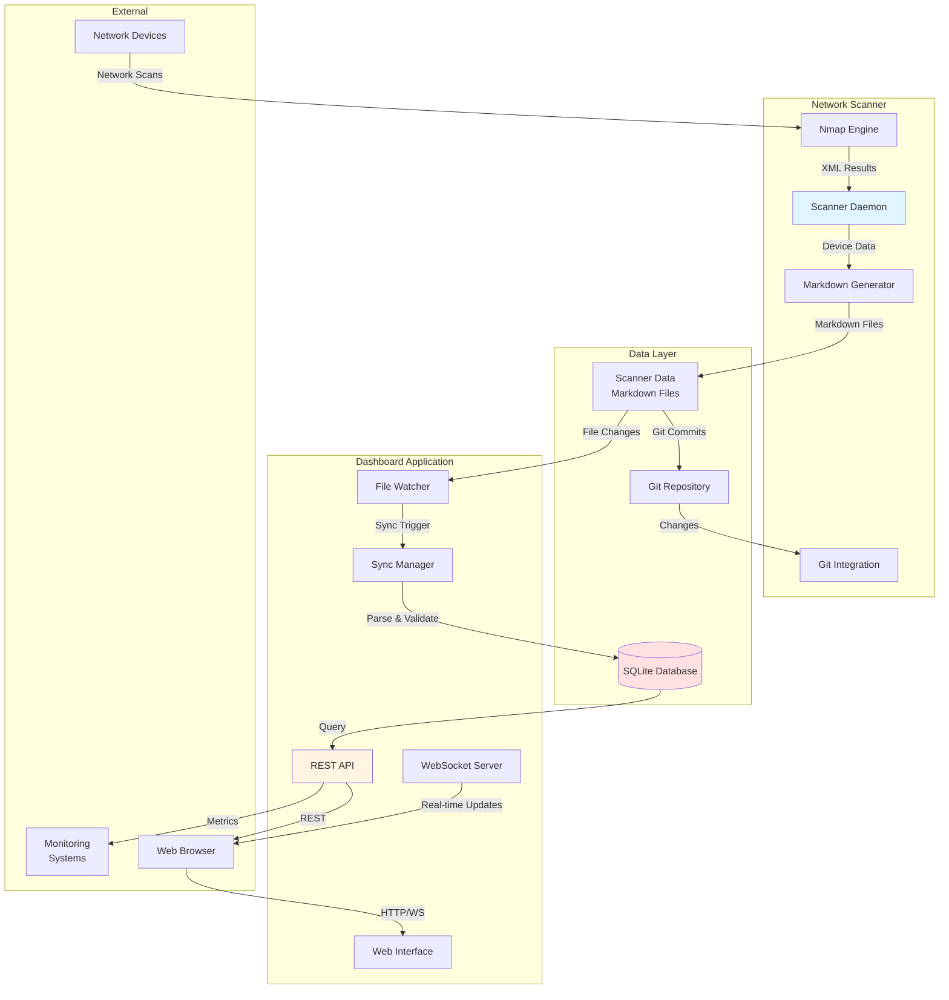

---

## Component Architecture

### Scanner Component

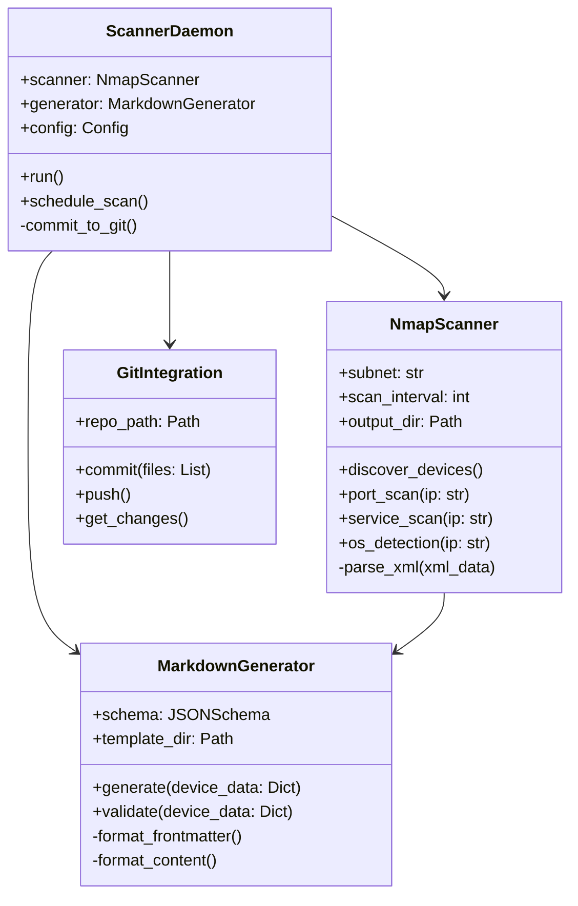

### Dashboard Component

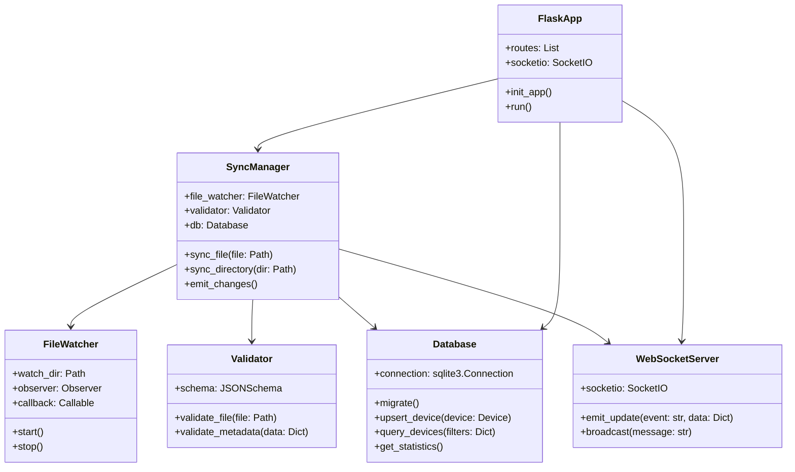

---

## Data Flow Architecture

### Scan to Dashboard Flow

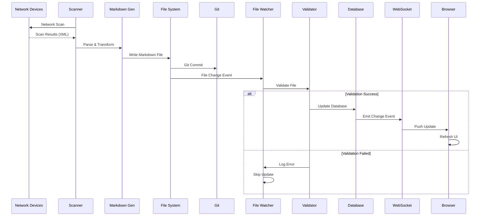

### API Request Flow

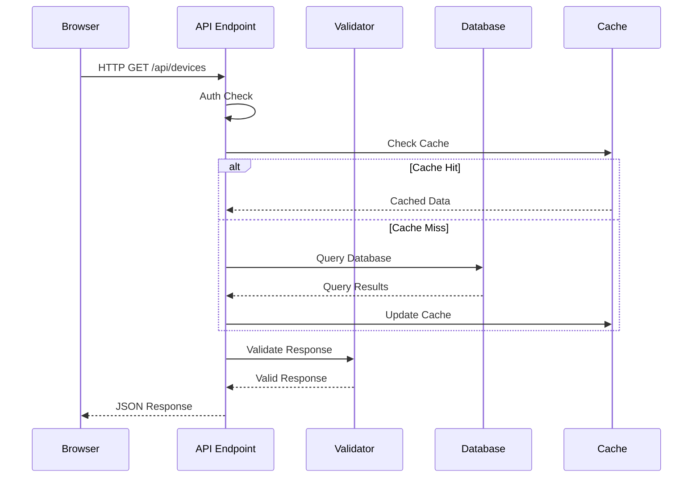

---

## Deployment Architecture

### Single Host Deployment

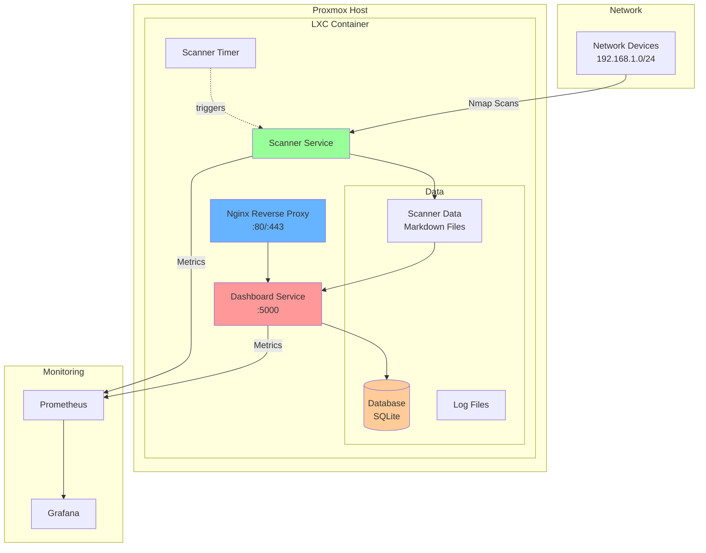

### High Availability Deployment

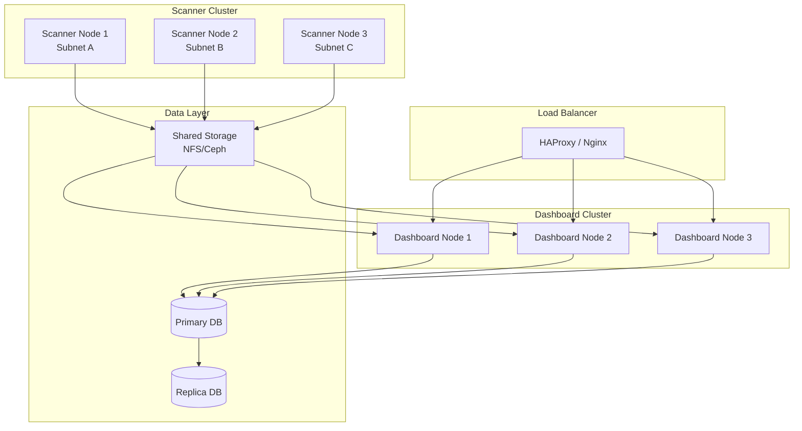

---

## Security Architecture

### Security Layers

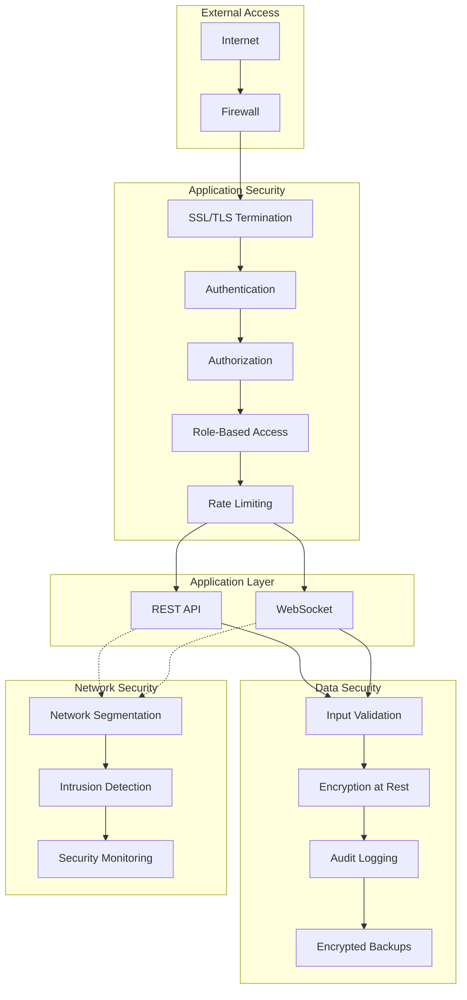

---

## Technology Stack

### Core Technologies

| Layer | Technology | Purpose |
|-------|-----------|---------|
| **Scanner** | Python 3.9+ | Core scanner application |
| | Nmap 7.80+ | Network scanning engine |
| | python-nmap | Nmap Python wrapper |
| | python-frontmatter | YAML frontmatter parsing |
| **Dashboard** | Flask 3.0 | Web application framework |
| | Flask-SocketIO | WebSocket support |
| | Gunicorn | WSGI HTTP server |
| | eventlet | Async worker |
| **Database** | SQLite 3.35+ | Embedded database |
| | WAL mode | Write-ahead logging |
| **Data Format** | Markdown | Device documentation |
| | YAML | Frontmatter metadata |
| | JSON Schema | Validation |
| **Version Control** | Git | Change tracking |
| **Process Management** | systemd | Service management |
| **Web Server** | Nginx | Reverse proxy (optional) |

### Development Tools

| Category | Tools |
|----------|-------|
| **Testing** | pytest, pytest-cov, pytest-flask |
| **Code Quality** | black, ruff, mypy, pylint |
| **Documentation** | Sphinx, MkDocs |
| **Monitoring** | Prometheus, Grafana |
| **CI/CD** | GitHub Actions |

---

## Performance Architecture

### Scalability Targets

| Metric | Target | Notes |
|--------|--------|-------|
| **Devices Monitored** | 1,000+ | Per scanner instance |
| **Scan Frequency** | 1-60 minutes | Configurable |
| **Dashboard Load Time** | < 2 seconds | Initial page load |
| **API Response Time** | < 200ms (p95) | Most endpoints |
| **WebSocket Latency** | < 100ms | Real-time updates |
| **Database Size** | 100MB-1GB | With 1 year history |
| **Memory Usage (Dashboard)** | < 512MB | Per instance |
| **Memory Usage (Scanner)** | < 256MB | Per instance |

### Performance Optimizations

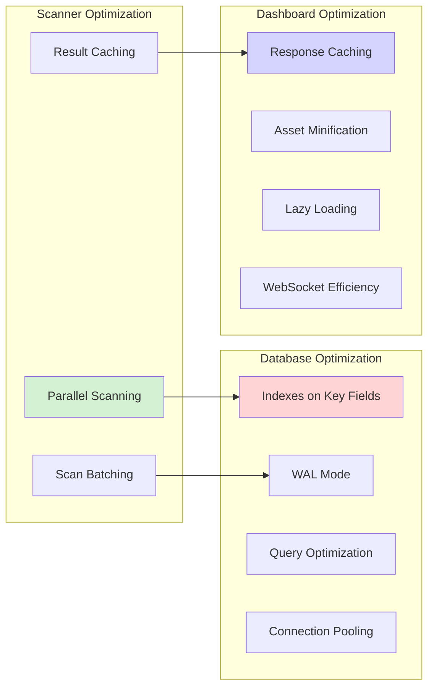

---

## Integration Architecture

### External System Integration

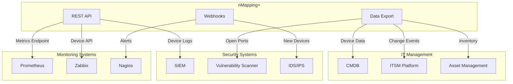

---

## Disaster Recovery Architecture

### Backup Strategy

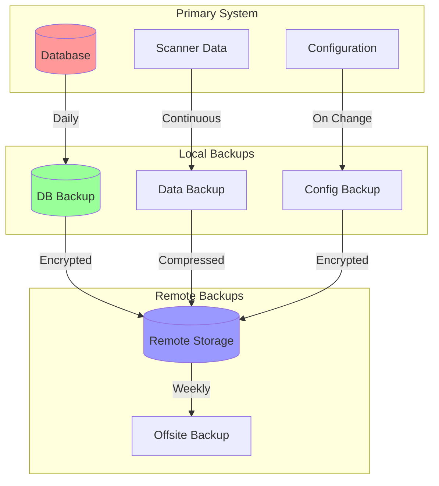

### Recovery Procedures

| Scenario | RTO | RPO | Procedure |
|----------|-----|-----|-----------|
| **Service Crash** | 5 minutes | 0 | Systemd auto-restart |
| **Database Corruption** | 30 minutes | 1 hour | Restore from local backup |
| **Data Loss** | 2 hours | 24 hours | Restore from remote backup |
| **Host Failure** | 4 hours | 24 hours | Deploy to new host |
| **Site Disaster** | 24 hours | 1 week | Restore from offsite backup |

---

## Monitoring Architecture

### Metrics Collection

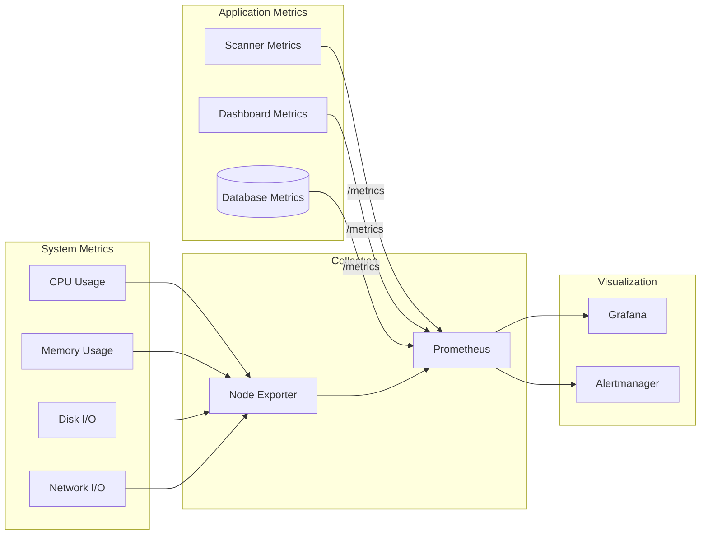

---

## Future Architecture Considerations

### Potential Enhancements

1. **Multi-Tenant Support**
   - Separate data isolation per tenant
   - Per-tenant RBAC
   - Resource quotas

2. **Microservices Migration**
   - Split scanner and dashboard
   - API gateway
   - Service mesh

3. **Cloud Native**
   - Kubernetes deployment
   - Horizontal auto-scaling
   - Cloud storage backends

4. **Advanced Features**
   - Machine learning for anomaly detection
   - Predictive maintenance
   - Advanced network mapping
   - Integration marketplace

---

## Conclusion

This architecture provides a solid foundation for the nMapping+ v1.0 release while allowing for future growth and enhancement. The modular design enables independent scaling of scanner and dashboard components, while the well-defined data contracts ensure maintainability.

---

**Document Owner**: Architecture Team  
**Review Date**: Quarterly  
**Next Review**: 2026-01-19
