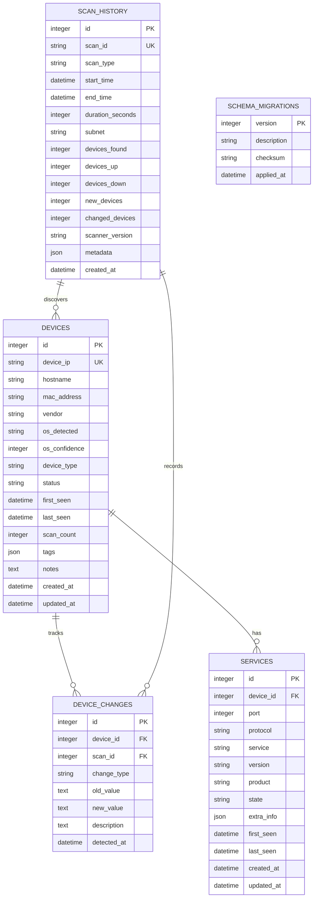

# nMapping+ Database Schema

**Database Engine**: SQLite 3.35+  
**Schema Version**: 1.0.0  
**Last Updated**: 2025-10-19

---

## Overview

The nMapping+ database uses SQLite for lightweight, embedded storage of network device inventory, scan history, and configuration data. The schema is designed for efficient querying of device information and maintaining scan history.

### Design Principles

1. **Normalization**: Tables normalized to 3NF to reduce redundancy
2. **Performance**: Strategic indexes on frequently queried columns
3. **History Tracking**: Comprehensive audit trail of scans and changes
4. **Scalability**: Supports 1000+ devices with sub-200ms query times
5. **Flexibility**: JSON fields for extensible metadata

---

## Entity Relationship Diagram



---

## Table Definitions

### devices

Stores information about discovered network devices.

```sql
CREATE TABLE devices (
    id INTEGER PRIMARY KEY AUTOINCREMENT,
    device_ip TEXT NOT NULL UNIQUE,
    hostname TEXT,
    mac_address TEXT,
    vendor TEXT,
    os_detected TEXT,
    os_confidence INTEGER DEFAULT 0,
    device_type TEXT DEFAULT 'unknown',
    status TEXT DEFAULT 'unknown',
    first_seen DATETIME NOT NULL,
    last_seen DATETIME NOT NULL,
    scan_count INTEGER DEFAULT 0,
    tags TEXT, -- JSON array
    notes TEXT,
    created_at DATETIME DEFAULT CURRENT_TIMESTAMP,
    updated_at DATETIME DEFAULT CURRENT_TIMESTAMP,
    
    CHECK (os_confidence >= 0 AND os_confidence <= 100),
    CHECK (device_type IN ('router', 'switch', 'server', 'workstation', 
                           'printer', 'iot', 'unknown')),
    CHECK (status IN ('up', 'down', 'unknown'))
);

CREATE UNIQUE INDEX idx_devices_ip ON devices(device_ip);
CREATE INDEX idx_devices_status ON devices(status);
CREATE INDEX idx_devices_type ON devices(device_type);
CREATE INDEX idx_devices_last_seen ON devices(last_seen DESC);
CREATE INDEX idx_devices_hostname ON devices(hostname);
```

**Column Descriptions:**

| Column | Type | Constraints | Description |
|--------|------|-------------|-------------|
| `id` | INTEGER | PRIMARY KEY, AUTOINCREMENT | Unique device identifier |
| `device_ip` | TEXT | NOT NULL, UNIQUE | Device IPv4 address |
| `hostname` | TEXT | - | Device hostname (if resolvable) |
| `mac_address` | TEXT | - | MAC address (format: XX:XX:XX:XX:XX:XX) |
| `vendor` | TEXT | - | Hardware vendor (from MAC OUI lookup) |
| `os_detected` | TEXT | - | Detected operating system |
| `os_confidence` | INTEGER | 0-100 | OS detection confidence percentage |
| `device_type` | TEXT | ENUM | Device category classification |
| `status` | TEXT | ENUM | Current device status |
| `first_seen` | DATETIME | NOT NULL | First discovery timestamp |
| `last_seen` | DATETIME | NOT NULL | Most recent scan timestamp |
| `scan_count` | INTEGER | DEFAULT 0 | Number of scans that found this device |
| `tags` | TEXT | JSON | User-defined tags (JSON array) |
| `notes` | TEXT | - | User notes about device |
| `created_at` | DATETIME | DEFAULT CURRENT_TIMESTAMP | Record creation timestamp |
| `updated_at` | DATETIME | DEFAULT CURRENT_TIMESTAMP | Last update timestamp |

**Example Row:**

```sql
INSERT INTO devices (
    device_ip, hostname, mac_address, vendor, os_detected, 
    os_confidence, device_type, status, first_seen, last_seen, 
    scan_count, tags, notes
) VALUES (
    '192.168.1.1',
    'router.local',
    '00:11:22:33:44:55',
    'Ubiquiti Networks',
    'Linux 5.4',
    95,
    'router',
    'up',
    '2025-01-01 00:00:00',
    '2025-10-19 09:45:00',
    142,
    '["core", "gateway"]',
    'Main network router - DO NOT REBOOT during business hours'
);
```

---

### services

Stores discovered network services (open ports) for each device.

```sql
CREATE TABLE services (
    id INTEGER PRIMARY KEY AUTOINCREMENT,
    device_id INTEGER NOT NULL,
    port INTEGER NOT NULL,
    protocol TEXT NOT NULL DEFAULT 'tcp',
    service TEXT,
    version TEXT,
    product TEXT,
    state TEXT DEFAULT 'open',
    extra_info TEXT, -- JSON object
    first_seen DATETIME NOT NULL,
    last_seen DATETIME NOT NULL,
    created_at DATETIME DEFAULT CURRENT_TIMESTAMP,
    updated_at DATETIME DEFAULT CURRENT_TIMESTAMP,
    
    FOREIGN KEY (device_id) REFERENCES devices(id) ON DELETE CASCADE,
    CHECK (port >= 1 AND port <= 65535),
    CHECK (protocol IN ('tcp', 'udp')),
    CHECK (state IN ('open', 'closed', 'filtered')),
    UNIQUE(device_id, port, protocol)
);

CREATE INDEX idx_services_device ON services(device_id);
CREATE INDEX idx_services_port ON services(port);
CREATE INDEX idx_services_service ON services(service);
CREATE INDEX idx_services_state ON services(state);
CREATE INDEX idx_services_last_seen ON services(last_seen DESC);
```

**Column Descriptions:**

| Column | Type | Constraints | Description |
|--------|------|-------------|-------------|
| `id` | INTEGER | PRIMARY KEY, AUTOINCREMENT | Unique service identifier |
| `device_id` | INTEGER | NOT NULL, FK | Reference to devices table |
| `port` | INTEGER | NOT NULL, 1-65535 | Port number |
| `protocol` | TEXT | NOT NULL, ENUM | Protocol (tcp/udp) |
| `service` | TEXT | - | Service name (e.g., http, ssh) |
| `version` | TEXT | - | Service version string |
| `product` | TEXT | - | Product name (e.g., nginx, Apache) |
| `state` | TEXT | ENUM | Port state (open/closed/filtered) |
| `extra_info` | TEXT | JSON | Additional service details |
| `first_seen` | DATETIME | NOT NULL | First discovery timestamp |
| `last_seen` | DATETIME | NOT NULL | Most recent scan timestamp |
| `created_at` | DATETIME | DEFAULT CURRENT_TIMESTAMP | Record creation timestamp |
| `updated_at` | DATETIME | DEFAULT CURRENT_TIMESTAMP | Last update timestamp |

**Example Row:**

```sql
INSERT INTO services (
    device_id, port, protocol, service, version, product, 
    state, extra_info, first_seen, last_seen
) VALUES (
    1,
    443,
    'tcp',
    'https',
    'nginx 1.21',
    'nginx',
    'open',
    '{"ssl": true, "certificate": "*.local.domain", "expires": "2026-01-01"}',
    '2025-01-01 00:00:00',
    '2025-10-19 09:45:00'
);
```

---

### scan_history

Stores metadata about each network scan performed.

```sql
CREATE TABLE scan_history (
    id INTEGER PRIMARY KEY AUTOINCREMENT,
    scan_id TEXT NOT NULL UNIQUE,
    scan_type TEXT NOT NULL,
    start_time DATETIME NOT NULL,
    end_time DATETIME,
    duration_seconds INTEGER,
    subnet TEXT NOT NULL,
    devices_found INTEGER DEFAULT 0,
    devices_up INTEGER DEFAULT 0,
    devices_down INTEGER DEFAULT 0,
    new_devices INTEGER DEFAULT 0,
    changed_devices INTEGER DEFAULT 0,
    scanner_version TEXT,
    metadata TEXT, -- JSON object
    created_at DATETIME DEFAULT CURRENT_TIMESTAMP,
    
    CHECK (scan_type IN ('discovery', 'quick_scan', 'full_scan', 'service_scan'))
);

CREATE UNIQUE INDEX idx_scan_id ON scan_history(scan_id);
CREATE INDEX idx_scan_start ON scan_history(start_time DESC);
CREATE INDEX idx_scan_type ON scan_history(scan_type);
CREATE INDEX idx_scan_subnet ON scan_history(subnet);
```

**Column Descriptions:**

| Column | Type | Constraints | Description |
|--------|------|-------------|-------------|
| `id` | INTEGER | PRIMARY KEY, AUTOINCREMENT | Unique scan identifier |
| `scan_id` | TEXT | NOT NULL, UNIQUE | UUID for scan tracking |
| `scan_type` | TEXT | NOT NULL, ENUM | Type of scan performed |
| `start_time` | DATETIME | NOT NULL | Scan start timestamp |
| `end_time` | DATETIME | - | Scan completion timestamp |
| `duration_seconds` | INTEGER | - | Scan duration in seconds |
| `subnet` | TEXT | NOT NULL | Scanned network subnet (CIDR notation) |
| `devices_found` | INTEGER | DEFAULT 0 | Total devices discovered |
| `devices_up` | INTEGER | DEFAULT 0 | Number of responsive devices |
| `devices_down` | INTEGER | DEFAULT 0 | Number of unresponsive devices |
| `new_devices` | INTEGER | DEFAULT 0 | Newly discovered devices |
| `changed_devices` | INTEGER | DEFAULT 0 | Devices with changes detected |
| `scanner_version` | TEXT | - | Scanner version string |
| `metadata` | TEXT | JSON | Additional scan metadata |
| `created_at` | DATETIME | DEFAULT CURRENT_TIMESTAMP | Record creation timestamp |

**Example Row:**

```sql
INSERT INTO scan_history (
    scan_id, scan_type, start_time, end_time, duration_seconds,
    subnet, devices_found, devices_up, devices_down, new_devices,
    changed_devices, scanner_version, metadata
) VALUES (
    'a1b2c3d4-e5f6-4a5b-8c9d-0e1f2a3b4c5d',
    'full_scan',
    '2025-10-19 09:00:00',
    '2025-10-19 09:15:00',
    900,
    '192.168.1.0/24',
    42,
    38,
    4,
    1,
    3,
    '1.0.0',
    '{"scan_options": "-sV -O", "triggered_by": "systemd_timer"}'
);
```

---

### device_changes

Tracks changes detected in devices across scans.

```sql
CREATE TABLE device_changes (
    id INTEGER PRIMARY KEY AUTOINCREMENT,
    device_id INTEGER NOT NULL,
    scan_id INTEGER NOT NULL,
    change_type TEXT NOT NULL,
    old_value TEXT,
    new_value TEXT,
    description TEXT,
    detected_at DATETIME NOT NULL,
    
    FOREIGN KEY (device_id) REFERENCES devices(id) ON DELETE CASCADE,
    FOREIGN KEY (scan_id) REFERENCES scan_history(id) ON DELETE CASCADE,
    CHECK (change_type IN ('new_device', 'device_offline', 'hostname_change', 
                           'service_added', 'service_removed', 'os_change', 
                           'status_change'))
);

CREATE INDEX idx_changes_device ON device_changes(device_id);
CREATE INDEX idx_changes_scan ON device_changes(scan_id);
CREATE INDEX idx_changes_type ON device_changes(change_type);
CREATE INDEX idx_changes_detected ON device_changes(detected_at DESC);
```

**Column Descriptions:**

| Column | Type | Constraints | Description |
|--------|------|-------------|-------------|
| `id` | INTEGER | PRIMARY KEY, AUTOINCREMENT | Unique change identifier |
| `device_id` | INTEGER | NOT NULL, FK | Reference to devices table |
| `scan_id` | INTEGER | NOT NULL, FK | Reference to scan_history table |
| `change_type` | TEXT | NOT NULL, ENUM | Type of change detected |
| `old_value` | TEXT | - | Previous value (if applicable) |
| `new_value` | TEXT | - | New value (if applicable) |
| `description` | TEXT | - | Human-readable change description |
| `detected_at` | DATETIME | NOT NULL | Change detection timestamp |

**Example Rows:**

```sql
INSERT INTO device_changes (
    device_id, scan_id, change_type, old_value, new_value, 
    description, detected_at
) VALUES 
(
    5,
    142,
    'new_device',
    NULL,
    '192.168.1.50',
    'New printer discovered',
    '2025-10-19 09:10:00'
),
(
    10,
    142,
    'service_added',
    NULL,
    'port 8080/tcp http',
    'Port 8080 now open with HTTP service',
    '2025-10-19 09:12:00'
);
```

---

### schema_migrations

Tracks applied database schema migrations for version control.

```sql
CREATE TABLE schema_migrations (
    version INTEGER PRIMARY KEY,
    description TEXT NOT NULL,
    checksum TEXT,
    applied_at DATETIME DEFAULT CURRENT_TIMESTAMP
);
```

**Column Descriptions:**

| Column | Type | Constraints | Description |
|--------|------|-------------|-------------|
| `version` | INTEGER | PRIMARY KEY | Migration version number |
| `description` | TEXT | NOT NULL | Human-readable migration description |
| `checksum` | TEXT | - | SHA256 hash of migration SQL file |
| `applied_at` | DATETIME | DEFAULT CURRENT_TIMESTAMP | Application timestamp |

**Example Rows:**

```sql
INSERT INTO schema_migrations (version, description, checksum) VALUES
(1, 'Initial schema creation', 'abc123...'),
(2, 'Add indexes for performance', 'def456...'),
(3, 'Add tags column to devices', 'ghi789...');
```

---

## Views

### v_device_summary

Simplified device view with service counts.

```sql
CREATE VIEW v_device_summary AS
SELECT 
    d.id,
    d.device_ip,
    d.hostname,
    d.device_type,
    d.status,
    d.last_seen,
    COUNT(s.id) as service_count,
    d.tags,
    d.notes
FROM devices d
LEFT JOIN services s ON d.id = s.device_id AND s.state = 'open'
GROUP BY d.id;
```

### v_recent_changes

Recent device changes with details.

```sql
CREATE VIEW v_recent_changes AS
SELECT 
    dc.id,
    d.device_ip,
    d.hostname,
    dc.change_type,
    dc.description,
    dc.detected_at,
    sh.scan_id,
    sh.scan_type
FROM device_changes dc
JOIN devices d ON dc.device_id = d.id
JOIN scan_history sh ON dc.scan_id = sh.id
ORDER BY dc.detected_at DESC
LIMIT 100;
```

---

## Common Queries

### Get all devices with services

```sql
SELECT 
    d.device_ip,
    d.hostname,
    d.device_type,
    d.status,
    json_group_array(
        json_object(
            'port', s.port,
            'service', s.service,
            'version', s.version
        )
    ) as services
FROM devices d
LEFT JOIN services s ON d.id = s.device_id AND s.state = 'open'
WHERE d.status = 'up'
GROUP BY d.id
ORDER BY d.device_ip;
```

### Get scan history with change counts

```sql
SELECT 
    sh.scan_id,
    sh.scan_type,
    sh.start_time,
    sh.duration_seconds,
    sh.devices_found,
    sh.new_devices,
    sh.changed_devices,
    COUNT(dc.id) as total_changes
FROM scan_history sh
LEFT JOIN device_changes dc ON sh.id = dc.scan_id
GROUP BY sh.id
ORDER BY sh.start_time DESC
LIMIT 20;
```

### Find devices with specific service

```sql
SELECT 
    d.device_ip,
    d.hostname,
    s.port,
    s.version,
    s.last_seen
FROM devices d
JOIN services s ON d.id = s.device_id
WHERE s.service = 'http'
  AND s.state = 'open'
  AND d.status = 'up'
ORDER BY d.device_ip;
```

### Get device change timeline

```sql
SELECT 
    dc.detected_at,
    d.device_ip,
    dc.change_type,
    dc.description,
    dc.old_value,
    dc.new_value
FROM device_changes dc
JOIN devices d ON dc.device_id = d.id
WHERE d.device_ip = '192.168.1.10'
ORDER BY dc.detected_at DESC;
```

### Statistics by device type

```sql
SELECT 
    device_type,
    COUNT(*) as total_devices,
    SUM(CASE WHEN status = 'up' THEN 1 ELSE 0 END) as devices_up,
    SUM(CASE WHEN status = 'down' THEN 1 ELSE 0 END) as devices_down,
    AVG(scan_count) as avg_scans
FROM devices
GROUP BY device_type
ORDER BY total_devices DESC;
```

---

## Indexes Strategy

### Performance Indexes

Critical indexes for query performance:

1. **Device Lookups**: `idx_devices_ip` (UNIQUE) - Primary device identification
2. **Status Filtering**: `idx_devices_status` - Filter by up/down/unknown
3. **Type Filtering**: `idx_devices_type` - Filter by device category
4. **Recent Activity**: `idx_devices_last_seen` - Sort by most recent scan
5. **Service Queries**: `idx_services_device`, `idx_services_port`, `idx_services_service`
6. **Scan History**: `idx_scan_start`, `idx_scan_type`, `idx_scan_subnet`
7. **Change Tracking**: `idx_changes_device`, `idx_changes_detected`

### Index Maintenance

```sql
-- Analyze tables for query optimization
ANALYZE;

-- Rebuild indexes (if needed)
REINDEX;

-- Check index usage
SELECT name, tbl_name, sql FROM sqlite_master 
WHERE type = 'index' 
ORDER BY tbl_name, name;
```

---

## Constraints & Validation

### Data Integrity Rules

1. **IP Address Format**: Validated in application layer (regex)
2. **Port Range**: `CHECK (port >= 1 AND port <= 65535)`
3. **OS Confidence**: `CHECK (os_confidence >= 0 AND os_confidence <= 100)`
4. **Enums**: Device type, status, protocol, scan type (CHECK constraints)
5. **Foreign Keys**: Cascading deletes for referential integrity
6. **Timestamps**: Automatic creation/update timestamps

### Trigger Examples

```sql
-- Update devices.updated_at on any change
CREATE TRIGGER update_device_timestamp 
AFTER UPDATE ON devices
BEGIN
    UPDATE devices SET updated_at = CURRENT_TIMESTAMP
    WHERE id = NEW.id;
END;

-- Update services.updated_at on any change
CREATE TRIGGER update_service_timestamp 
AFTER UPDATE ON services
BEGIN
    UPDATE services SET updated_at = CURRENT_TIMESTAMP
    WHERE id = NEW.id;
END;

-- Increment scan_count when device seen in new scan
CREATE TRIGGER increment_scan_count
AFTER INSERT ON device_changes
WHEN NEW.change_type != 'device_offline'
BEGIN
    UPDATE devices 
    SET scan_count = scan_count + 1
    WHERE id = NEW.device_id;
END;
```

---

## Database Maintenance

### Backup Strategy

```bash
# Daily backup
sqlite3 /dashboard/nmapping.db ".backup /backups/nmapping-$(date +%Y%m%d).db"

# Compress backup
gzip /backups/nmapping-$(date +%Y%m%d).db

# Retention: Keep 30 days
find /backups -name "nmapping-*.db.gz" -mtime +30 -delete
```

### Optimization

```sql
-- Vacuum to reclaim space and defragment
VACUUM;

-- Analyze for query optimization
ANALYZE;

-- Check database integrity
PRAGMA integrity_check;

-- Enable WAL mode for better concurrency
PRAGMA journal_mode=WAL;

-- Set page size for performance
PRAGMA page_size=4096;

-- Set cache size (10MB)
PRAGMA cache_size=-10000;
```

### Growth Estimation

| Timeframe | Devices | Scans | Estimated Size |
|-----------|---------|-------|----------------|
| 1 month | 100 | 720 | 5 MB |
| 6 months | 100 | 4,320 | 25 MB |
| 1 year | 100 | 8,760 | 50 MB |
| 1 year | 1000 | 8,760 | 200 MB |

---

## Migration Management

### Migration File Structure

```
/dashboard/migrations/
  001_initial_schema.sql
  002_add_indexes.sql
  003_add_tags_column.sql
  004_create_views.sql
```

### Migration Template

```sql
-- Migration: 003_add_tags_column.sql
-- Description: Add tags column to devices table
-- Date: 2025-10-19

BEGIN TRANSACTION;

-- Add new column
ALTER TABLE devices ADD COLUMN tags TEXT;

-- Update schema version
INSERT INTO schema_migrations (version, description, checksum) 
VALUES (3, 'Add tags column to devices', 'checksum-here');

COMMIT;
```

### Rollback Strategy

```sql
-- Rollback migration 003
BEGIN TRANSACTION;

-- Remove column (SQLite limitation: create new table)
CREATE TABLE devices_new AS 
SELECT id, device_ip, hostname, mac_address, vendor, 
       os_detected, os_confidence, device_type, status,
       first_seen, last_seen, scan_count, notes,
       created_at, updated_at
FROM devices;

DROP TABLE devices;
ALTER TABLE devices_new RENAME TO devices;

-- Recreate indexes
-- ...

-- Remove migration record
DELETE FROM schema_migrations WHERE version = 3;

COMMIT;
```

---

## Performance Benchmarks

### Query Performance Targets

| Query Type | Target Time | Tested With |
|------------|-------------|-------------|
| Get all devices | < 100ms | 1000 devices |
| Get device by IP | < 10ms | 1000 devices |
| Get device with services | < 50ms | 100 services |
| Scan history (last 30 days) | < 100ms | 8760 scans |
| Device changes (last 7 days) | < 50ms | 10000 changes |

### Database Size Limits

- **Max Devices**: 100,000+
- **Max Services per Device**: 1,000
- **Max Scan History**: Unlimited (with archival)
- **Database File Size**: < 1GB for typical deployment

---

**Document Owner**: Database Team  
**Review Date**: Quarterly  
**Next Review**: 2026-01-19
