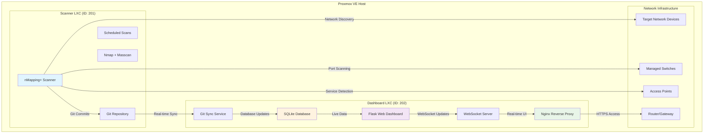

# nMapping+ Enhanced Deployment Guide

## Overview

This comprehensive guide provides step-by-step instructions for deploying the **nMapping+** network monitoring system with real-time web dashboard using **Proxmox VE Community Scripts** as the foundation for reliable LXC container deployment.

## Architecture Overview



## Prerequisites

### System Requirements

- **Proxmox VE**: Version 8.0 or higher
- **RAM**: Minimum 4GB available for containers
- **Storage**: 20GB available space
- **Network**: Internet access for downloads and updates
- **CPU**: 4+ cores recommended for optimal performance

### Network Requirements

- Scanner container needs access to target networks
- Dashboard container needs web access from management network
- Git communication between containers
- Optional: Dedicated VLAN for monitoring traffic

## Quick Start Deployment

### 1. Download Deployment Scripts

On your Proxmox VE host, download the nMapping+ deployment tools:

```bash
# Create deployment directory
mkdir -p /root/nmapping-plus
cd /root/nmapping-plus


# Download the complete nMapping+ package
wget https://github.com/th3Wheel/nmapping-plus/archive/main.zip
unzip main.zip
cd nmapping-plus-main

# Make scripts executable
chmod +x scripts/*.sh
```

### 2. Interactive Container Creation

Run the enhanced LXC creation wizard:

```bash
# Launch the interactive deployment wizard
./scripts/create_nmap_lxc.sh

# Follow the prompts to:
# - Select deployment type (dual containers recommended)
# - Configure container specifications
# - Set network parameters
# - Choose installation options
```

### 3. Automated Component Installation

After container creation, run the post-deployment setup:

```bash
# Run the automated setup script generated by the wizard
./nmapping_plus_setup.sh

# This will:
# - Install nMapping+ scanner in LXC 201
# - Install enhanced dashboard in LXC 202
# - Configure Git synchronization
# - Set up networking and firewall rules
```

## Detailed Deployment Steps

### Step 1: Foundation with Community Scripts

nMapping+ leverages battle-tested Proxmox VE Community Scripts for reliable container deployment:

#### Why Community Scripts?

- **300+ proven installation scripts** tested by the community
- **Optimized container configurations** for different use cases
- **Regular security updates** and maintenance
- **Consistent deployment patterns** across environments
- **Active community support** and documentation

#### Scanner Container (LXC 201)

```bash
# Create scanner container using community Debian script
bash -c "$(wget -qLO - https://github.com/community-scripts/ProxmoxVE/raw/main/ct/debian.sh)"

# Recommended configuration:
# - Container ID: 201
# - Hostname: nmapping-scanner  
# - OS: Debian 12 (bookworm)
# - CPU Cores: 2
# - Memory: 1024 MB
# - Storage: 4 GB
# - Network: DHCP on vmbr0
# - Unprivileged: Yes
# - Start on boot: Yes
```

#### Dashboard Container (LXC 202)

```bash
# Create dashboard container using community Debian script
bash -c "$(wget -qLO - https://github.com/community-scripts/ProxmoxVE/raw/main/ct/debian.sh)"

# Recommended configuration:
# - Container ID: 202
# - Hostname: nmapping-dashboard
# - OS: Debian 12 (bookworm)
# - CPU Cores: 2
# - Memory: 2048 MB
# - Storage: 8 GB
# - Network: DHCP on vmbr0
# - Unprivileged: Yes
# - Start on boot: Yes
```

### Step 2: Scanner Installation and Configuration

Install and configure the nMapping+ scanner components:

```bash
# Enter scanner container
pct exec 201 -- bash


# Download and run scanner installation script
cd /tmp
wget https://raw.githubusercontent.com/th3Wheel/nmapping-plus/main/scripts/install_nmap_fingplus.sh
chmod +x install_nmap_fingplus.sh
./install_nmap_fingplus.sh

# Configure scanning targets
nano /nmap/config/targets.conf
```

#### Scanner Features Installed

- **Nmap**: Advanced network discovery and port scanning
- **Masscan**: High-speed port scanner for large networks
- **Python Scripts**: Custom fingerprinting and vulnerability detection
- **Git Integration**: Automated change tracking and versioning
- **Cron Scheduling**: Automated scanning at regular intervals
- **API Integration**: REST endpoints for dashboard communication

### Step 3: Dashboard Installation and Configuration

Install and configure the enhanced web dashboard:

```bash
# Enter dashboard container
pct exec 202 -- bash


# Download and run enhanced dashboard installation
cd /tmp
wget https://raw.githubusercontent.com/th3Wheel/nmapping-plus/main/scripts/install_dashboard_enhanced.sh
chmod +x install_dashboard_enhanced.sh
./install_dashboard_enhanced.sh

# Follow prompts for:
# - Scanner repository URL configuration
# - SSL certificate setup (optional)
# - Email notification settings (optional)
```

#### Dashboard Features Installed

- **Flask Web Application**: Real-time network monitoring interface
- **WebSocket Integration**: Live updates without page refresh
- **SQLite Database**: Optimized for fast queries and analytics
- **Nginx Reverse Proxy**: Production-ready web server with caching
- **Interactive Topology**: Vis.js network visualization
- **Mobile Responsive**: Works on tablets and smartphones
- **API Endpoints**: RESTful API for third-party integrations

### Step 4: Git Synchronization Setup

Configure secure communication between scanner and dashboard:

```bash
# Generate SSH keys for Git synchronization
pct exec 201 -- sudo -u scanner ssh-keygen -t ed25519 -C "nmapping-scanner"
pct exec 202 -- sudo -u nmapping ssh-keygen -t ed25519 -C "nmapping-dashboard"

# Copy public keys between containers for passwordless access
# Scanner public key to dashboard
pct exec 201 -- sudo -u scanner cat /home/scanner/.ssh/id_ed25519.pub
pct exec 202 -- sudo -u nmapping mkdir -p /home/nmapping/.ssh
pct exec 202 -- sudo -u nmapping nano /home/nmapping/.ssh/authorized_keys

# Test Git connectivity
pct exec 202 -- sudo -u nmapping git ls-remote scanner@scanner-ip:/nmap/registry
```

### Step 5: Network and Firewall Configuration

Configure networking for optimal security and performance:

```bash
# On Proxmox host - configure container networking
# Allow scanner to reach target networks
pct set 201 -net0 name=eth0,bridge=vmbr0,ip=dhcp,firewall=1

# Configure dashboard for web access
pct set 202 -net0 name=eth0,bridge=vmbr0,ip=dhcp,firewall=1

# Set up Proxmox firewall rules (optional)
# Create firewall rule for dashboard HTTP access
pvesh create /nodes/$(hostname)/qemu/202/firewall/rules --action ACCEPT --type in --dport 80 --proto tcp

# Create firewall rule for dashboard HTTPS access  
pvesh create /nodes/$(hostname)/qemu/202/firewall/rules --action ACCEPT --type in --dport 443 --proto tcp
```

## Advanced Configuration

### High Availability Setup

For production environments, consider implementing high availability:

```bash
# Create backup scanner container
pct clone 201 301 --hostname nmapping-scanner-backup --full

# Set up load balancer for multiple dashboards
apt install haproxy
nano /etc/haproxy/haproxy.cfg
```

### SSL/TLS Certificate Configuration

Secure your dashboard with SSL certificates:

```bash
# Enter dashboard container
pct exec 202 -- bash

# Install Certbot for Let's Encrypt certificates
apt install certbot python3-certbot-nginx

# Obtain SSL certificate
certbot --nginx -d your-dashboard-domain.com

# Verify automatic renewal
certbot renew --dry-run
```

### Database Optimization

For large networks, optimize the SQLite database:

```bash
# Enter dashboard container and optimize database
pct exec 202 -- sudo -u nmapping sqlite3 /dashboard/data/dashboard.db

# Run optimization commands
PRAGMA optimize;
PRAGMA vacuum;
PRAGMA integrity_check;
```

### Custom Scanning Profiles

Create custom scanning profiles for different network types:

```bash
# Enter scanner container
pct exec 201 -- bash

# Create custom scan profiles
mkdir -p /nmap/profiles
cat > /nmap/profiles/office_network.conf << EOF
# Office Network Scanning Profile
TARGETS="192.168.1.0/24"
SCAN_TYPE="comprehensive"
PORT_RANGE="1-65535"
TIMING="T3"
SCRIPTS="default,vuln"
EOF
```

## Monitoring and Maintenance

### Log Management

Configure comprehensive logging for troubleshooting:

```bash
# Configure logrotate for scanner logs
pct exec 201 -- nano /etc/logrotate.d/nmapping-scanner

# Configure logrotate for dashboard logs  
pct exec 202 -- nano /etc/logrotate.d/nmapping-dashboard

# View real-time logs
pct exec 201 -- tail -f /nmap/logs/scanner.log
pct exec 202 -- journalctl -u nmapping-dashboard -f
```

### Performance Monitoring

Monitor container performance:

```bash
# Monitor container resource usage
pct status 201
pct status 202

# View detailed resource consumption
cat /proc/$(pct pid 201)/status
cat /proc/$(pct pid 202)/status

# Monitor network traffic
pct exec 201 -- iftop
pct exec 202 -- netstat -tuln
```

### Backup and Recovery

Implement comprehensive backup strategy:

```bash
# Create container snapshots
vzdump 201 --mode stop --compress gzip --storage local
vzdump 202 --mode stop --compress gzip --storage local

# Backup Git repository data
pct exec 201 -- tar -czf /tmp/nmap-data-backup.tar.gz /nmap/

# Backup dashboard database
pct exec 202 -- sqlite3 /dashboard/data/dashboard.db ".backup '/tmp/dashboard-backup.db'"
```

## Troubleshooting

### Common Issues and Solutions

#### Scanner Container Issues

```bash
# Check scanner service status
pct exec 201 -- systemctl status nmapping-scanner

# Verify Nmap installation
pct exec 201 -- nmap --version

# Test network connectivity
pct exec 201 -- ping 8.8.8.8
pct exec 201 -- nmap -sn 192.168.1.1
```

#### Dashboard Container Issues

```bash
# Check dashboard service status
pct exec 202 -- systemctl status nmapping-dashboard

# Check Nginx status
pct exec 202 -- systemctl status nginx

# Verify database connectivity
pct exec 202 -- sudo -u nmapping sqlite3 /dashboard/data/dashboard.db ".tables"

# Check WebSocket connectivity
pct exec 202 -- netstat -tuln | grep 5000
```

#### Git Synchronization Issues

```bash
# Test Git connectivity
pct exec 202 -- sudo -u nmapping git ls-remote scanner-ip:/nmap/registry

# Check SSH key authentication
pct exec 202 -- sudo -u nmapping ssh -T scanner@scanner-ip

# Verify Git repository integrity
pct exec 201 -- sudo -u scanner git fsck
```

### Performance Optimization

#### Scanner Performance

```bash
# Optimize Nmap scanning performance
pct exec 201 -- nano /nmap/config/scan_optimization.conf

# Adjust CPU limits for intensive scans
pct set 201 -cores 4 -cpulimit 2

# Increase memory for large network scans
pct set 201 -memory 2048
```

#### Dashboard Performance

```bash
# Optimize SQLite database
pct exec 202 -- sudo -u nmapping sqlite3 /dashboard/data/dashboard.db "PRAGMA optimize;"

# Configure Nginx caching
pct exec 202 -- nano /etc/nginx/sites-available/nmapping-dashboard

# Optimize Python application
pct exec 202 -- pip install gunicorn
pct exec 202 -- systemctl enable gunicorn
```

## Integration and API Usage

### RESTful API Endpoints

The nMapping+ dashboard provides comprehensive REST API:

```bash
# Get all devices
curl -X GET http://dashboard-ip/api/devices

# Get device details
curl -X GET http://dashboard-ip/api/devices/{device_ip}

# Get scan history
curl -X GET http://dashboard-ip/api/scans

# Get network changes
curl -X GET http://dashboard-ip/api/changes

# System health check
curl -X GET http://dashboard-ip/api/health
```

### Third-party Integrations

#### SIEM Integration

```bash
# Configure syslog forwarding
pct exec 202 -- nano /etc/rsyslog.d/nmapping.conf

# Forward alerts to SIEM
echo "*.info @siem-server:514" >> /etc/rsyslog.d/nmapping.conf
```

#### Monitoring Integration

```bash
# Prometheus metrics endpoint
curl http://dashboard-ip/metrics

# Grafana dashboard import
# Use dashboard ID: nmapping-plus-monitoring
```

## Scaling and Performance

### Horizontal Scaling

For large networks, implement horizontal scaling:

```bash
# Create additional scanner containers
./scripts/create_nmap_lxc.sh --scanner
# Configure for different network segments

# Load balance multiple dashboards
apt install haproxy
nano /etc/haproxy/haproxy.cfg
```

### Database Scaling

For high-volume environments:

```bash
# Migrate to PostgreSQL
pct exec 202 -- apt install postgresql-client
# Configure external PostgreSQL server

# Implement database partitioning
# Create monthly partition tables for historical data
```

## Security Hardening

### Container Security

Implement security best practices:

```bash
# Enable container firewall
pct set 201 -firewall 1
pct set 202 -firewall 1

# Configure AppArmor profiles
nano /etc/apparmor.d/lxc-containers

# Implement resource limits
pct set 201 -cpulimit 2 -memory 1024
pct set 202 -cpulimit 2 -memory 2048
```

### Network Security

Secure network communications:

```bash
# Configure VPN access
apt install openvpn
nano /etc/openvpn/nmapping.conf

# Implement network segmentation
# Use VLANs to isolate monitoring traffic

# Configure fail2ban
pct exec 202 -- apt install fail2ban
pct exec 202 -- nano /etc/fail2ban/jail.local
```

## Conclusion

This comprehensive deployment guide provides everything needed to successfully deploy nMapping+ in production environments. The combination of Proxmox VE Community Scripts foundation with custom nMapping+ components ensures:

- **Reliable Deployment**: Proven community scripts reduce deployment risks
- **Production Ready**: Enterprise-grade features and security
- **Scalable Architecture**: Horizontal and vertical scaling options
- **Comprehensive Monitoring**: Real-time visibility into network changes
- **Easy Maintenance**: Automated updates and comprehensive logging

For additional support and community resources:

- 📖 **Documentation**: [GitHub Repository](https://github.com/th3Wheel/nmapping-plus)
- 💬 **Community**: [Discussion Forum](https://github.com/th3Wheel/nmapping-plus/discussions)
- 🐛 **Issues**: [Bug Reports](https://github.com/th3Wheel/nmapping-plus/issues)
- 🚀 **Updates**: [Release Notes](https://github.com/th3Wheel/nmapping-plus/releases)

---

**nMapping+ v1.0.0** - Self-hosted network mapping with real-time web dashboard
