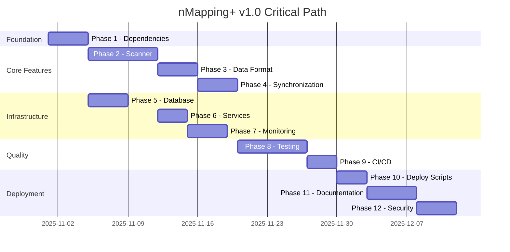
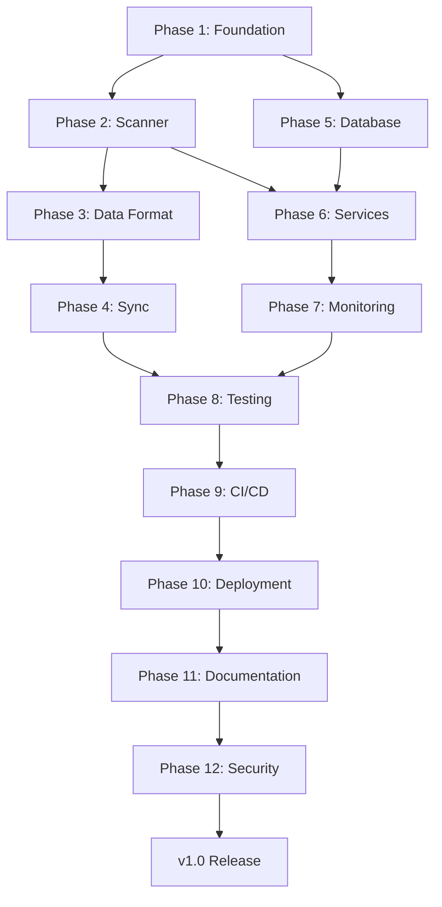

# nMapping+ v1.0 Implementation Timeline

**Project**: nMapping+ Production Release  
**Version**: 1.0.0  
**Status**: 🔵 Planned  
**Start Date**: TBD  
**Target Completion**: 6-8 weeks from start

---

## Project Overview

Transform nMapping+ from foundation (v0.1.0) to production-ready v1.0 release with complete functionality, comprehensive testing, and production-grade infrastructure.

**Total Tasks**: 150 across 12 phases  
**Estimated Effort**: 180-220 person-hours

---

## Phase Timeline

| Phase | Duration | Effort (hrs) | Dependencies | Start | End |
|-------|----------|--------------|--------------|-------|-----|
| **Phase 1**: Foundation & Core Dependencies | 3-4 days | 16-20 | None | Week 1 | Week 1 |
| **Phase 2**: Network Scanner Core | 5-7 days | 40-50 | Phase 1 | Week 1 | Week 2 |
| **Phase 3**: Data Format & Validation | 3-4 days | 24-30 | Phase 2 | Week 2 | Week 3 |
| **Phase 4**: Scanner-Dashboard Sync | 3-4 days | 20-24 | Phase 3 | Week 3 | Week 3 |
| **Phase 5**: Database Management | 3-4 days | 20-24 | Phase 1 | Week 3 | Week 4 |
| **Phase 6**: Systemd Services | 2-3 days | 16-20 | Phase 2, 5 | Week 4 | Week 4 |
| **Phase 7**: Logging & Monitoring | 3-4 days | 24-28 | Phase 2, 5 | Week 4 | Week 5 |
| **Phase 8**: Testing Framework | 5-7 days | 40-50 | All Core | Week 5 | Week 6 |
| **Phase 9**: CI/CD Enhancement | 2-3 days | 12-16 | Phase 8 | Week 6 | Week 6 |
| **Phase 10**: Deployment Scripts | 2-3 days | 12-16 | Phase 6, 8 | Week 6 | Week 7 |
| **Phase 11**: Documentation | 4-5 days | 32-40 | All | Week 7 | Week 8 |
| **Phase 12**: Security & Production | 3-4 days | 24-30 | All | Week 8 | Week 8 |

---

## Critical Path

---

## Milestone Schedule

### Milestone 1: Foundation Complete (Week 1)

**Target Date**: End of Week 1  
**Deliverables**:

* ✅ Python dependencies installable
* ✅ Configuration system working
* ✅ Development environment reproducible
* ✅ Scanner architecture designed

**Exit Criteria**:

* All Phase 1 tasks complete
* TASK-013 (Scanner architecture) approved
* Clean installation tested on Ubuntu 22.04

---

### Milestone 2: Scanner Functional (Week 2)

**Target Date**: End of Week 2  
**Deliverables**:

* ✅ Network discovery working
* ✅ Port scanning functional
* ✅ Markdown output generated
* ✅ Basic CLI interface working

**Exit Criteria**:

* Scanner can discover devices
* Scanner generates valid markdown
* Manual scan execution works
* Phase 2 complete

---

### Milestone 3: Data Integration Complete (Week 3)

**Target Date**: End of Week 3  
**Deliverables**:

* ✅ Data format specification published
* ✅ JSON schemas created
* ✅ Scanner-dashboard sync working
* ✅ Database migrations functional

**Exit Criteria**:

* Data validation working
* Sync tested with 100+ devices
* Database migrations tested
* Phases 3, 4, 5 complete

---

### Milestone 4: Production Infrastructure (Week 4-5)

**Target Date**: End of Week 5  
**Deliverables**:

* ✅ Systemd services working
* ✅ Logging infrastructure deployed
* ✅ Metrics collection functional
* ✅ Health checks implemented

**Exit Criteria**:

* Services auto-start and restart
* Logs captured and rotated
* Prometheus metrics available
* Phases 6, 7 complete

---

### Milestone 5: Quality Assurance (Week 6)

**Target Date**: End of Week 6  
**Deliverables**:

* ✅ Test framework complete
* ✅ >80% code coverage achieved
* ✅ CI/CD pipeline functional
* ✅ All tests passing

**Exit Criteria**:

* Unit, integration, E2E tests written
* Coverage threshold met
* CI/CD running on every commit
* Phases 8, 9 complete

---

### Milestone 6: Production Ready (Week 7-8)

**Target Date**: End of Week 8  
**Deliverables**:

* ✅ Deployment tested end-to-end
* ✅ Documentation complete
* ✅ Security hardening done
* ✅ Production checklist verified

**Exit Criteria**:

* Clean deployment from scratch works
* All documentation reviewed
* Security audit passed
* Ready for v1.0 release
* Phases 10, 11, 12 complete

---

## Resource Allocation

### Week-by-Week Focus

**Week 1: Foundation & Scanner Start**

* Primary: Phase 1 (Foundation)
* Primary: Phase 2 (Scanner) - Architecture & Core
* Team: 1-2 developers

**Week 2: Scanner Completion**

* Primary: Phase 2 (Scanner) - Complete implementation
* Secondary: Phase 3 (Data Format) - Start specification
* Team: 1-2 developers

**Week 3: Data & Sync**

* Primary: Phase 3 (Data Format)
* Primary: Phase 4 (Sync)
* Primary: Phase 5 (Database)
* Team: 1-2 developers

**Week 4: Infrastructure**

* Primary: Phase 6 (Services)
* Primary: Phase 7 (Monitoring)
* Team: 1-2 developers + DevOps

**Week 5: Testing Start**

* Primary: Phase 8 (Testing Framework)
* Secondary: Complete any Phase 6-7 items
* Team: 1-2 developers + QA

**Week 6: Testing & CI/CD**

* Primary: Phase 8 (Testing) - Complete
* Primary: Phase 9 (CI/CD)
* Primary: Phase 10 (Deployment) - Start
* Team: 1-2 developers + QA + DevOps

**Week 7: Documentation**

* Primary: Phase 11 (Documentation)
* Secondary: Phase 10 (Deployment) - Complete
* Team: 1-2 developers + Tech Writer

**Week 8: Security & Final Prep**

* Primary: Phase 12 (Security)
* Secondary: Final testing and fixes
* Team: Full team + Security review

---

## Risk Management

### High-Risk Items

| Risk | Impact | Probability | Mitigation | Owner |
|------|--------|-------------|------------|-------|
| Scanner implementation takes longer than estimated | High | Medium | Start early, parallel work on data format | Dev Lead |
| Testing reveals fundamental design issues | High | Low | Incremental testing, early validation | QA Lead |
| Nmap integration more complex than expected | Medium | Medium | Research early, prototype scanner | Developer |
| Performance issues with large networks | Medium | Low | Load testing in Phase 8 | Developer |
| Security vulnerabilities discovered late | High | Low | Security review in Phase 12 | Security |
| Deployment scripts fail on various configs | Medium | Medium | Test on multiple Proxmox versions | DevOps |

### Mitigation Strategies

1. **Early Validation**: Test critical components early (scanner, data format)
2. **Parallel Work**: Database and data format can proceed in parallel
3. **Incremental Testing**: Test each phase before moving to next
4. **Documentation As You Go**: Update docs with each feature
5. **Security First**: Include security considerations in every phase

---

## Success Metrics

### v1.0 Release Criteria

**Functional Requirements**:

* ✅ Scanner can discover devices on network
* ✅ Scanner can enumerate ports and services
* ✅ Dashboard displays device inventory
* ✅ Real-time updates work via WebSocket
* ✅ Git-based change tracking functional
* ✅ Systemd services auto-start and restart

**Quality Requirements**:

* ✅ >80% code coverage
* ✅ All critical tests passing
* ✅ No high/critical security vulnerabilities
* ✅ Performance targets met (Dashboard <2s load, API <200ms p95)

**Operational Requirements**:

* ✅ Clean deployment from scratch works
* ✅ Backup/restore procedures tested
* ✅ Monitoring and alerting configured
* ✅ Documentation complete and reviewed

**Infrastructure Requirements**:

* ✅ CI/CD pipeline running
* ✅ Automated security scanning
* ✅ Release automation configured
* ✅ Branch protection rules set

---

## Phase Dependencies

---

## Change Management

### Version Control

* **Feature Branches**: Each phase has dedicated branch `feature/phase-X-name`
* **Pull Requests**: Required for all changes
* **Code Review**: Minimum 1 reviewer approval
* **Conventional Commits**: Required for changelog generation

### Release Strategy

* **v0.1.0**: Current foundation (existing code)
* **v0.2.0**: After Phase 2 (Scanner functional)
* **v0.5.0**: After Phase 5 (Core features complete)
* **v0.9.0**: After Phase 10 (Pre-release candidate)
* **v1.0.0**: After Phase 12 (Production release)

---

## Communication Plan

### Weekly Standups

* **When**: Every Monday 9:00 AM
* **Duration**: 30 minutes
* **Agenda**: Progress, blockers, upcoming tasks

### Phase Reviews

* **When**: End of each phase
* **Duration**: 1 hour
* **Agenda**: Demo, retrospective, next phase planning

### Stakeholder Updates

* **When**: Weekly
* **Format**: Written summary + milestone dashboard
* **Content**: Progress, risks, timeline adjustments

---

## Next Steps

1. **Review and approve this timeline** with team and stakeholders
2. **Assign phase owners** for each implementation phase
3. **Set start date** and adjust calendar dates
4. **Create GitHub project board** with all 150 tasks
5. **Begin Phase 1** - Foundation & Core Dependencies

---

**Document Owner**: twheeler
**Last Updated**: 2025-10-19  
**Next Review**: Pending kickoff
