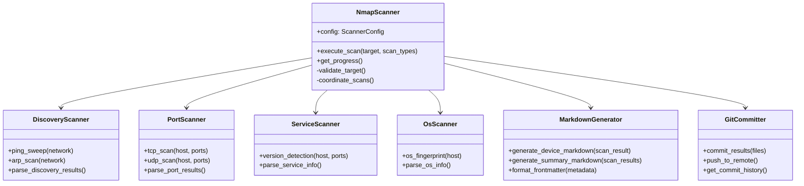

# Phase 2: Network Scanner Core Implementation - Detailed Task Specifications

**Parent Plan**: [feature-nmapping-implementation-1.md](../feature-nmapping-implementation-1.md)  
**Phase Goal**: Implement complete network scanning functionality  
**Priority**: 🔴 Critical - Core feature of the application  
**Estimated Duration**: 5-7 days

---

## TASK-013: Design Scanner Architecture

### Description

Design modular scanner architecture supporting multiple scan types with clear separation of concerns and extensibility.

### Acceptance Criteria

- [ ] Architecture document created with class diagrams
- [ ] Scan type modules clearly defined (discovery, ports, services, OS)
- [ ] Data flow documented from Nmap → Parser → Markdown Generator
- [ ] Error handling strategy documented
- [ ] Extension points identified for custom scans

### Implementation Details

**Create Document**: `docs/architecture/scanner-architecture.md`

**Architecture Components**:

1. **NmapScanner** (Main orchestrator)
   - Manages scan lifecycle
   - Coordinates scan type modules
   - Handles configuration
   - Aggregates results

2. **Scan Type Modules**:
   - `DiscoveryScanner`: Host discovery (ping sweep, ARP)
   - `PortScanner`: Port enumeration (TCP/UDP)
   - `ServiceScanner`: Service version detection
   - `OsScanner`: Operating system fingerprinting

3. **Result Processors**:
   - `NmapParser`: Parse XML output
   - `MarkdownGenerator`: Convert to markdown
   - `GitCommitter`: Commit results to repository

4. **Utilities**:
   - `NetworkRangeParser`: Parse CIDR/range notation
   - `ScanScheduler`: Schedule recurring scans
   - `ProgressReporter`: Real-time progress updates

**Class Diagram** (Mermaid):



### Testing Steps

1. Review architecture with team
2. Identify potential issues or improvements
3. Validate against requirements (REQ-002, REQ-003)
4. Get stakeholder approval

### Dependencies

- Phase 1 completed

### Estimated Time

4 hours

---

## TASK-014: Create scripts/nmap_scanner.py Main Implementation

### Description

Implement the core NmapScanner class with scan orchestration, configuration management, and result aggregation.

### Acceptance Criteria

- [ ] File created: `scripts/nmap_scanner.py`
- [ ] NmapScanner class implemented with all core methods
- [ ] Command-line interface functional
- [ ] Configuration loading works
- [ ] Logging implemented
- [ ] Error handling comprehensive
- [ ] Code documented with docstrings

### Implementation Details

**File Location**: `i:\obsidian\Homelab Vault\nMapping+\scripts\nmap_scanner.py`

**Core Structure** (500+ lines):

```python
#!/usr/bin/env python3
"""
nMapping+ Network Scanner
Main scanner implementation using Nmap for network discovery and enumeration.
"""

import os
import sys
import argparse
import logging
import json
from pathlib import Path
from typing import Dict, List, Optional, Set
from dataclasses import dataclass, asdict
from datetime import datetime
import subprocess
import xml.etree.ElementTree as ET

# Configure logging
logging.basicConfig(
    level=logging.INFO,
    format=''%(asctime)s [%(levelname)s] %(name)s: %(message)s'',
    handlers=[
        logging.StreamHandler(),
        logging.FileHandler(''/var/log/nmapping/scanner.log'')
    ]
)
logger = logging.getLogger(''nmapping.scanner'')


@dataclass
class ScanResult:
    """Data class for scan results"""
    ip_address: str
    hostname: Optional[str] = None
    mac_address: Optional[str] = None
    os_name: Optional[str] = None
    os_accuracy: Optional[int] = None
    status: str = ''unknown''
    ports: List[Dict] = None
    services: List[Dict] = None
    scan_time: str = None
    
    def __post_init__(self):
        if self.ports is None:
            self.ports = []
        if self.services is None:
            self.services = []
        if self.scan_time is None:
            self.scan_time = datetime.now().isoformat()


class NmapScanner:
    """
    Main network scanner class using Nmap.
    
    Coordinates different scan types and aggregates results.
    """
    
    def __init__(self, config_path: Optional[Path] = None):
        """
        Initialize scanner with configuration.
        
        Args:
            config_path: Path to scanner configuration YAML file
        """
        self.config = self._load_config(config_path)
        self.results: Dict[str, ScanResult] = {}
        self.scan_id = datetime.now().strftime(''%Y%m%d_%H%M%S'')
        
        logger.info(f"Scanner initialized with scan ID: {self.scan_id}")
    
    def _load_config(self, config_path: Optional[Path]) -> Dict:
        """Load scanner configuration"""
        # TODO: Implement YAML config loading
        # For now, return defaults
        return {
            ''scan_types'': [''discovery'', ''ports'', ''services''],
            ''timing_template'': ''T4'',
            ''max_retries'': 3,
            ''output_format'': ''markdown'',
            ''git_enabled'': True
        }
    
    def execute_scan(self, target: str, scan_types: Optional[List[str]] = None) -> Dict[str, ScanResult]:
        """
        Execute complete scan on target network.
        
        Args:
            target: Network target (CIDR notation, IP range, or single IP)
            scan_types: List of scan types to perform (discovery, ports, services, os)
        
        Returns:
            Dictionary of IP addresses to ScanResult objects
        """
        logger.info(f"Starting scan of target: {target}")
        
        # Validate target
        if not self._validate_target(target):
            raise ValueError(f"Invalid scan target: {target}")
        
        # Determine scan types
        scan_types = scan_types or self.config.get(''scan_types'', [''discovery''])
        
        # Phase 1: Host Discovery
        if ''discovery'' in scan_types:
            live_hosts = self._discovery_scan(target)
            logger.info(f"Discovery found {len(live_hosts)} live hosts")
        else:
            # Assume target is a single host
            live_hosts = [target]
        
        # Phase 2: Port Scanning
        if ''ports'' in scan_types:
            for host in live_hosts:
                self._port_scan(host)
        
        # Phase 3: Service Detection
        if ''services'' in scan_types:
            for host in live_hosts:
                self._service_scan(host)
        
        # Phase 4: OS Fingerprinting
        if ''os'' in scan_types:
            for host in live_hosts:
                self._os_scan(host)
        
        logger.info(f"Scan complete. Results for {len(self.results)} hosts")
        return self.results
    
    def _validate_target(self, target: str) -> bool:
        """Validate scan target format"""
        # TODO: Implement proper CIDR/IP validation
        return True
    
    def _discovery_scan(self, target: str) -> List[str]:
        """
        Perform host discovery scan.
        
        Args:
            target: Network target
        
        Returns:
            List of live host IP addresses
        """
        logger.info(f"Running discovery scan on {target}")
        
        # Build Nmap command
        cmd = [
            ''nmap'',
            ''-sn'',  # Ping scan (no port scan)
            ''-T4'',  # Timing template
            ''-oX'', ''-'',  # XML output to stdout
            target
        ]
        
        try:
            result = subprocess.run(
                cmd,
                capture_output=True,
                text=True,
                timeout=300,
                check=True
            )
            
            # Parse XML output
            live_hosts = self._parse_discovery_xml(result.stdout)
            
            # Initialize results for each host
            for host in live_hosts:
                if host not in self.results:
                    self.results[host] = ScanResult(
                        ip_address=host,
                        status=''up''
                    )
            
            return live_hosts
            
        except subprocess.TimeoutExpired:
            logger.error(f"Discovery scan timed out for {target}")
            return []
        except subprocess.CalledProcessError as e:
            logger.error(f"Nmap discovery scan failed: {e.stderr}")
            return []
    
    def _parse_discovery_xml(self, xml_output: str) -> List[str]:
        """Parse Nmap XML output for live hosts"""
        live_hosts = []
        
        try:
            root = ET.fromstring(xml_output)
            
            for host in root.findall(''host''):
                # Check if host is up
                status = host.find(''status'')
                if status is not None and status.get(''state'') == ''up'':
                    # Get IP address
                    address = host.find(''address'')
                    if address is not None:
                        ip = address.get(''addr'')
                        live_hosts.append(ip)
                        
                        # Get hostname if available
                        hostnames = host.find(''hostnames'')
                        if hostnames is not None:
                            hostname = hostnames.find(''hostname'')
                            if hostname is not None and ip in self.results:
                                self.results[ip].hostname = hostname.get(''name'')
        
        except ET.ParseError as e:
            logger.error(f"Failed to parse Nmap XML: {e}")
        
        return live_hosts
    
    def _port_scan(self, host: str) -> None:
        """
        Perform port scan on host.
        
        Args:
            host: Target IP address
        """
        logger.info(f"Running port scan on {host}")
        
        cmd = [
            ''nmap'',
            ''-Pn'',  # Skip host discovery
            ''-sS'',  # TCP SYN scan
            ''-T4'',
            ''--top-ports'', ''1000'',  # Scan top 1000 ports
            ''-oX'', ''-'',
            host
        ]
        
        try:
            result = subprocess.run(
                cmd,
                capture_output=True,
                text=True,
                timeout=600,
                check=True
            )
            
            # Parse results
            self._parse_port_xml(host, result.stdout)
            
        except subprocess.TimeoutExpired:
            logger.error(f"Port scan timed out for {host}")
        except subprocess.CalledProcessError as e:
            logger.error(f"Port scan failed for {host}: {e.stderr}")
    
    def _parse_port_xml(self, host: str, xml_output: str) -> None:
        """Parse Nmap XML for port information"""
        try:
            root = ET.fromstring(xml_output)
            
            # Find the host element
            host_elem = root.find(f".//host[address[@addr=''{host}'']]")
            if host_elem is None:
                return
            
            # Get ports
            ports_elem = host_elem.find(''ports'')
            if ports_elem is not None:
                for port in ports_elem.findall(''port''):
                    port_id = port.get(''portid'')
                    protocol = port.get(''protocol'')
                    
                    state = port.find(''state'')
                    if state is not None and state.get(''state'') == ''open'':
                        port_info = {
                            ''port'': int(port_id),
                            ''protocol'': protocol,
                            ''state'': ''open''
                        }
                        
                        # Get service info if available
                        service = port.find(''service'')
                        if service is not None:
                            port_info[''service''] = service.get(''name'')
                            port_info[''product''] = service.get(''product'')
                            port_info[''version''] = service.get(''version'')
                        
                        self.results[host].ports.append(port_info)
        
        except ET.ParseError as e:
            logger.error(f"Failed to parse port XML for {host}: {e}")
    
    def _service_scan(self, host: str) -> None:
        """Perform service version detection"""
        logger.info(f"Running service detection on {host}")
        # Similar to port scan but with -sV flag
        pass
    
    def _os_scan(self, host: str) -> None:
        """Perform OS fingerprinting"""
        logger.info(f"Running OS detection on {host}")
        
        cmd = [
            ''nmap'',
            ''-Pn'',
            ''-O'',  # OS detection
            ''-oX'', ''-'',
            host
        ]
        
        try:
            result = subprocess.run(
                cmd,
                capture_output=True,
                text=True,
                timeout=300,
                check=True
            )
            
            self._parse_os_xml(host, result.stdout)
            
        except subprocess.CalledProcessError as e:
            logger.warning(f"OS detection failed for {host} (may require root): {e.stderr}")
    
    def _parse_os_xml(self, host: str, xml_output: str) -> None:
        """Parse OS detection results"""
        try:
            root = ET.fromstring(xml_output)
            host_elem = root.find(f".//host[address[@addr=''{host}'']]")
            
            if host_elem is not None:
                os_elem = host_elem.find(''os'')
                if os_elem is not None:
                    osmatch = os_elem.find(''osmatch'')
                    if osmatch is not None:
                        self.results[host].os_name = osmatch.get(''name'')
                        self.results[host].os_accuracy = int(osmatch.get(''accuracy'', 0))
        
        except ET.ParseError as e:
            logger.error(f"Failed to parse OS XML for {host}: {e}")
    
    def get_results_json(self) -> str:
        """Export results as JSON"""
        results_dict = {
            ip: asdict(result) 
            for ip, result in self.results.items()
        }
        return json.dumps(results_dict, indent=2)
    
    def save_results(self, output_dir: Path) -> None:
        """Save scan results to output directory"""
        output_dir = Path(output_dir)
        output_dir.mkdir(parents=True, exist_ok=True)
        
        # Save JSON results
        json_file = output_dir / f"scan_{self.scan_id}.json"
        with open(json_file, ''w'') as f:
            f.write(self.get_results_json())
        
        logger.info(f"Results saved to {json_file}")


def main():
    """Command-line interface for scanner"""
    parser = argparse.ArgumentParser(
        description=''nMapping+ Network Scanner'',
        formatter_class=argparse.RawDescriptionHelpFormatter
    )
    
    parser.add_argument(
        ''target'',
        help=''Target network (CIDR notation, IP range, or single IP)''
    )
    
    parser.add_argument(
        ''--scan-types'',
        nargs=''+'',
        choices=[''discovery'', ''ports'', ''services'', ''os''],
        default=[''discovery'', ''ports''],
        help=''Types of scans to perform''
    )
    
    parser.add_argument(
        ''--output'',
        default=''/tmp/nmapping'',
        help=''Output directory for results''
    )
    
    parser.add_argument(
        ''--config'',
        type=Path,
        help=''Path to scanner configuration file''
    )
    
    parser.add_argument(
        ''-v'', ''--verbose'',
        action=''store_true'',
        help=''Enable verbose logging''
    )
    
    args = parser.parse_args()
    
    if args.verbose:
        logging.getLogger().setLevel(logging.DEBUG)
    
    try:
        # Initialize scanner
        scanner = NmapScanner(config_path=args.config)
        
        # Execute scan
        results = scanner.execute_scan(
            target=args.target,
            scan_types=args.scan_types
        )
        
        # Save results
        scanner.save_results(Path(args.output))
        
        # Print summary
        print(f"\nScan Summary:")
        print(f"  Hosts scanned: {len(results)}")
        print(f"  Total open ports: {sum(len(r.ports) for r in results.values())}")
        
        sys.exit(0)
        
    except Exception as e:
        logger.error(f"Scan failed: {e}", exc_info=True)
        sys.exit(1)


if __name__ == ''__main__'':
    main()
```

### Testing Steps

1. Create test script with sample target
2. Run discovery scan: `python nmap_scanner.py 192.168.1.0/24 --scan-types discovery`
3. Run full scan: `python nmap_scanner.py 192.168.1.1 --scan-types discovery ports services`
4. Verify JSON output created
5. Check logging output
6. Test error handling with invalid target

### Dependencies

- TASK-013 (Architecture design)
- Nmap installed on system
- Python 3.9+

### Estimated Time

8-10 hours

---

## TASK-018: Create MarkdownGenerator Class

### Description

Implement markdown generation from scan results compatible with dashboard parsing requirements.

### Acceptance Criteria

- [ ] MarkdownGenerator class created
- [ ] Device markdown files generated with proper frontmatter
- [ ] Scan summary markdown files generated
- [ ] Output matches data format specification
- [ ] Validates against JSON schemas
- [ ] Handles missing data gracefully

### Implementation Details

**Add to**: `scripts/nmap_scanner.py` or create `scripts/markdown_generator.py`

```python
class MarkdownGenerator:
    """
    Generate markdown files from scan results.
    """
    
    def generate_device_markdown(self, result: ScanResult) -> str:
        """
        Generate markdown file for a single device.
        
        Args:
            result: ScanResult object
        
        Returns:
            Markdown content as string
        """
        # Frontmatter
        frontmatter = {
            ''ip'': result.ip_address,
            ''hostname'': result.hostname or ''Unknown'',
            ''mac'': result.mac_address or ''Unknown'',
            ''os'': result.os_name or ''Unknown'',
            ''os_accuracy'': result.os_accuracy or 0,
            ''status'': result.status,
            ''last_seen'': result.scan_time,
            ''port_count'': len(result.ports)
        }
        
        md = "---\n"
        for key, value in frontmatter.items():
            md += f"{key}: {value}\n"
        md += "---\n\n"
        
        # Device header
        md += f"# Device: {result.ip_address}\n\n"
        
        if result.hostname:
            md += f"**Hostname**: {result.hostname}\n\n"
        
        # Status
        status_emoji = "🟢" if result.status == ''up'' else "🔴"
        md += f"**Status**: {status_emoji} {result.status.upper()}\n\n"
        
        # Operating System
        if result.os_name:
            md += f"## Operating System\n\n"
            md += f"- **OS**: {result.os_name}\n"
            md += f"- **Accuracy**: {result.os_accuracy}%\n\n"
        
        # Open Ports
        if result.ports:
            md += f"## Open Ports ({len(result.ports)})\n\n"
            md += "| Port | Protocol | Service | Version |\n"
            md += "|------|----------|---------|----------|\n"
            
            for port in sorted(result.ports, key=lambda p: p[''port'']):
                service = port.get(''service'', ''Unknown'')
                version = port.get(''version'', '''')
                product = port.get(''product'', '''')
                version_str = f"{product} {version}".strip() or ''-''
                
                md += f"| {port[''port'']} | {port[''protocol'']} | {service} | {version_str} |\n"
            
            md += "\n"
        
        # Scan Information
        md += f"## Scan Information\n\n"
        md += f"- **Last Scanned**: {result.scan_time}\n"
        md += f"- **Scanner Version**: nMapping+ v1.0\n\n"
        
        return md
    
    def save_device_markdown(self, result: ScanResult, output_dir: Path) -> Path:
        """Save device markdown to file"""
        output_dir = Path(output_dir)
        output_dir.mkdir(parents=True, exist_ok=True)
        
        # Sanitize filename
        filename = f"{result.ip_address}.md"
        filepath = output_dir / filename
        
        markdown = self.generate_device_markdown(result)
        
        with open(filepath, ''w'') as f:
            f.write(markdown)
        
        return filepath
```

### Testing Steps

1. Create ScanResult test object
2. Generate markdown: `md = generator.generate_device_markdown(result)`
3. Verify frontmatter YAML is valid
4. Verify markdown renders correctly
5. Test with missing data (no OS, no ports)
6. Validate against schema

### Dependencies

- TASK-014 (ScanResult dataclass)
- TASK-028, TASK-029 (JSON schemas created)

### Estimated Time

4 hours

---

## Phase 2 Summary

**Total Tasks**: 12  
**Critical Path**: TASK-013 → TASK-014 → TASK-018 → TASK-019  
**Estimated Total Time**: 5-7 days  
**Blockers**: Requires Phase 1 completion

**Success Criteria**:

- [ ] Scanner can discover devices on network
- [ ] Scanner can enumerate ports and services
- [ ] Scanner generates valid markdown output
- [ ] Scanner commits results to Git repository
- [ ] Error handling works for all failure scenarios
- [ ] Command-line interface is functional
- [ ] Code is well-documented and tested
